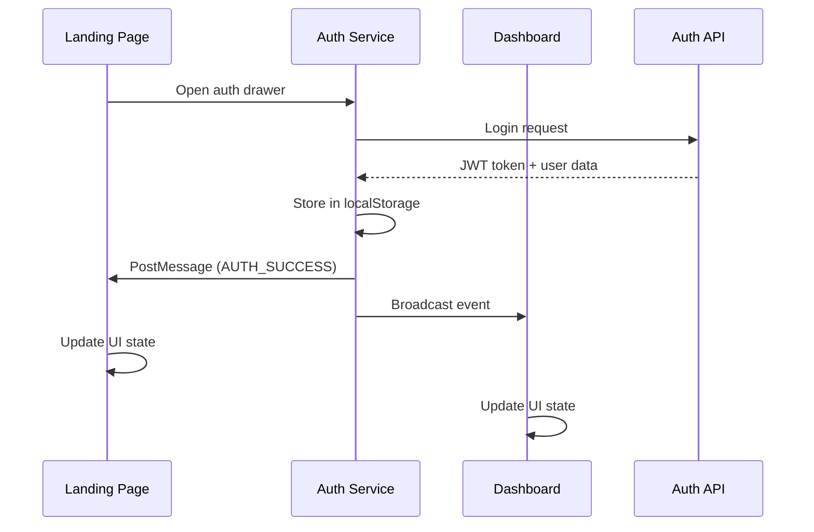
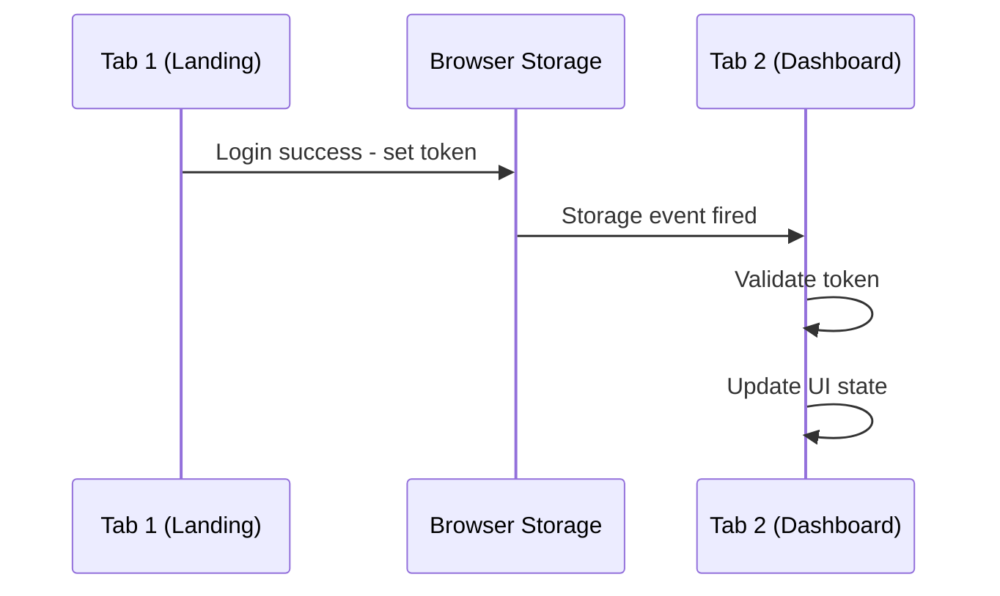
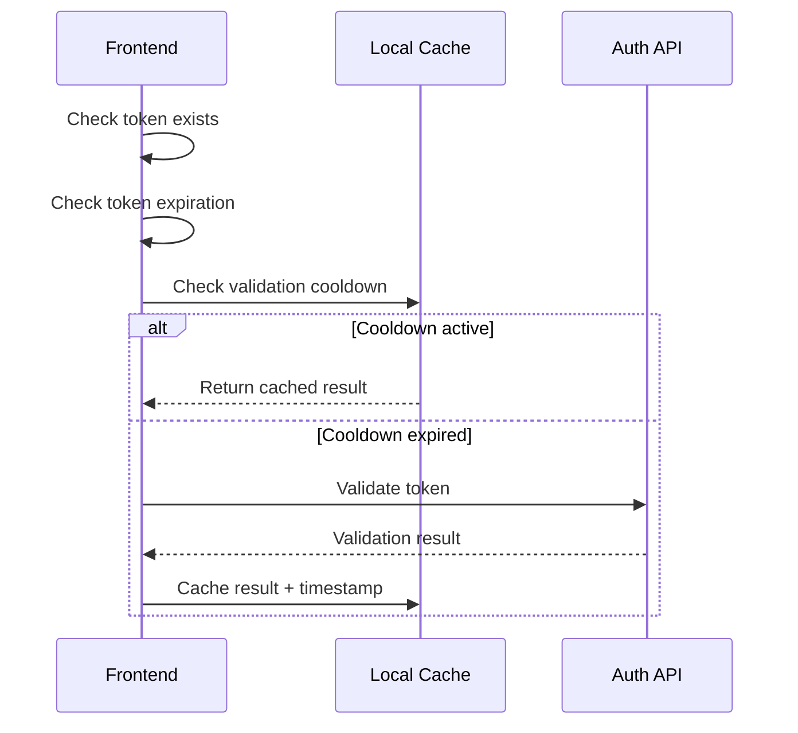

# Authentication Shared State Management - Synkro Frontend Services

## Overview

The Synkro project implements a sophisticated authentication state management system that enables seamless authentication sharing across multiple frontend services. The system uses a combination of localStorage, cross-origin messaging, custom events, and token validation to maintain consistent authentication state.

## Frontend Services Architecture

The project consists of three main frontend services:

1. **Frontend Landing** (Astro) - `localhost:4321` - Main landing page
2. **Frontend Dashboard** (Next.js) - `localhost:3003` - Dashboard interface  
3. **Frontend Auth** (Vue + Vite) - `localhost:5173` - Authentication interface

## Core Authentication State Management Components

### 1. Local Storage Management

Authentication data is stored in localStorage using both primary and fallback keys:

**Primary Keys:**
- `AUTH_TOKEN_KEY` / `synkro_token` - JWT authentication token
- `AUTH_USER_KEY` / `synkro_user` - User profile data

**Fallback Keys:**
- `token` - Legacy token key
- `user` - Legacy user key
- `auth_state_timestamp` - Timestamp for state synchronization
- `auth_broadcast_event` - Event broadcasting mechanism

### 2. Cross-Service Communication Mechanisms

#### A. PostMessage API
Used for secure cross-origin communication between services running on different ports:

```typescript
// Message types from frontend-auth
enum MessageType {
  AUTH_SUCCESS = "AUTH_SUCCESS",
  AUTH_ERROR = "AUTH_ERROR", 
  AUTH_LOGOUT = "AUTH_LOGOUT",
  REGISTRATION_SUCCESS = "REGISTRATION_SUCCESS",
  AUTH_STATUS_AUTHENTICATED = "AUTH_STATUS_AUTHENTICATED",
  AUTH_STATUS_UNAUTHENTICATED = "AUTH_STATUS_UNAUTHENTICATED"
}
```

**Trusted Origins:**
- Auth Service: `http://localhost:3000`
- Auth Interface: `http://localhost:5173`
- Dashboard Service: `http://localhost:3003`

#### B. Storage Events
Browser's storage event mechanism synchronizes authentication state across tabs and windows:

```javascript
window.addEventListener("storage", (event) => {
  if (event.key === AUTH_TOKEN_KEY || event.key === "token") {
    validateToken(true);
    checkStorageForAuthChanges();
  }
});
```

#### C. Custom Events
Internal event system for component communication within the same application:

```javascript
window.dispatchEvent(new CustomEvent("auth-state-changed", {
  detail: {
    isAuthenticated: boolean,
    user: User | null
  }
}));
```

### 3. Token Validation System

#### Multi-Layer Validation
1. **Client-side JWT expiration check**
2. **Server-side token validation via API**
3. **Periodic validation with cooldown mechanism**

#### Validation Flow:
```javascript
async function validateToken(forceCheck = false) {
  // 1. Check if token exists
  const token = localStorage.getItem(AUTH_TOKEN_KEY);
  if (!token) return false;
  
  // 2. Client-side expiration check
  if (isTokenExpired(token)) {
    clearAuth();
    return false;
  }
  
  // 3. Cooldown mechanism (2-10 seconds)
  if (!forceCheck && now - lastValidationTime < VALIDATION_COOLDOWN) {
    return true;
  }
  
  // 4. Server-side validation
  const response = await fetch(`${AUTH_SERVICE_URL}/api/auth/validate-token`, {
    method: "POST",
    body: JSON.stringify({ token })
  });
  
  const data = await response.json();
  return data.isValid;
}
```

### 4. Broadcast Event System

Special localStorage-based broadcasting mechanism for real-time state synchronization:

```javascript
// Broadcasting authentication events
const broadcastEvent = {
  type: "LOGIN_SUCCESS",
  user: userData,
  access_token: token,
  timestamp: Date.now()
};
localStorage.setItem("auth_broadcast_event", JSON.stringify(broadcastEvent));
```

## Service-Specific Implementations

### Frontend Landing (Astro)

**Key Features:**
- Header component with authentication buttons
- Auth drawer integration
- Real-time state updates via storage events
- Cross-origin message handling

**Implementation Location:** `frontend-landing/src/components/organisms/Header.astro`

**Key Functions:**
- `setupAuthButtons()` - Initializes authentication UI
- `validateToken()` - Token validation with server
- `checkStorageForAuthChanges()` - Monitors localStorage changes
- Message listeners for cross-origin communication

### Frontend Dashboard (Next.js)

**Key Features:**
- AuthService class with singleton pattern
- Server-side rendering compatibility
- Token validation caching
- Automatic auth checking intervals

**Implementation Location:** `frontend-dashboard/src/services/auth.service.ts`

**Key Components:**
- `AuthService` - Main authentication service
- `AuthController` - Authentication controller layer
- Token validation caching mechanism
- Cross-origin event broadcasting

### Frontend Auth (Vue + Pinia)

**Key Features:**
- Pinia store for reactive state management
- Message broadcasting to parent windows
- Token validation endpoint
- Cross-service communication utilities

**Implementation Location:** `frontend-auth/src/stores/auth.store.ts`

**Key Components:**
- `useAuthStore()` - Pinia authentication store
- `messaging.ts` - Cross-service communication utilities
- Storage event handling for multi-tab sync

## Authentication Flow Sequence

### 1. Login Flow


### 2. Cross-Tab Synchronization


### 3. Token Validation Flow


## State Synchronization Mechanisms

### 1. Real-time Cross-Tab Sync
- **Mechanism:** Browser storage events
- **Frequency:** Immediate on localStorage changes
- **Coverage:** All tabs/windows of same origin

### 2. Cross-Origin Communication  
- **Mechanism:** PostMessage API
- **Security:** Trusted origin validation
- **Usage:** iframe ↔ parent window communication

### 3. Periodic Validation
- **Frequency:** Every 30 seconds
- **Purpose:** Server-side token validation
- **Optimization:** Cooldown periods to prevent excessive API calls

### 4. Visibility-based Validation
- **Trigger:** Tab becomes visible
- **Purpose:** Refresh stale authentication state
- **Implementation:** Document visibility API

## Configuration Management

### Environment Variables

**Frontend Landing:**
```javascript
PUBLIC_AUTH_TOKEN_KEY = "synkro_token"
PUBLIC_AUTH_USER_KEY = "synkro_user"  
PUBLIC_AUTH_SERVICE_URL = "http://localhost:3000"
PUBLIC_AUTH_INTERFACE_URL = "http://localhost:5173"
PUBLIC_DASHBOARD_SERVICE_URL = "http://localhost:3003"
```

**Frontend Dashboard:**
```javascript
NEXT_PUBLIC_AUTH_SERVICE_URL = "http://localhost:3000"
NEXT_PUBLIC_AUTH_INTERFACE_URL = "http://localhost:5173"
```

**Frontend Auth:**
```javascript
VITE_AUTH_TOKEN_KEY = "auth_token"
VITE_AUTH_USER_KEY = "auth_user"
VITE_API_URL = "http://localhost:3000/api"
```

## Security Considerations

### 1. Origin Validation
All cross-origin messages are validated against trusted origins list:

```javascript
const trustedOrigins = [
  AUTH_SERVICE_URL,
  AUTH_INTERFACE_URL, 
  DASHBOARD_SERVICE_URL
];
```

### 2. Token Security
- JWT tokens are validated both client-side and server-side
- Automatic cleanup on token expiration
- Secure storage in localStorage with fallback keys

### 3. Message Validation
- Structured message types with enum validation
- Timestamp-based event expiration (5-second window)
- Source validation to prevent React DevTools interference

## Error Handling & Recovery

### 1. Token Expiration
- Automatic detection via JWT payload parsing
- Graceful auth state clearing
- UI state updates to reflect unauthenticated state

### 2. Network Failures
- Fallback to cached validation results during network issues
- Retry mechanisms for critical operations
- Graceful degradation of non-essential features

### 3. Storage Issues
- Try-catch blocks around localStorage operations
- Fallback behavior when storage is unavailable
- Error logging for debugging

## Best Practices Implemented

1. **Singleton Pattern:** AuthService uses singleton to ensure single source of truth
2. **Event-Driven Architecture:** Custom events for loose coupling between components  
3. **Caching Strategy:** Token validation results cached with TTL
4. **Graceful Degradation:** System works even with partial failures
5. **Security First:** Origin validation and structured message passing
6. **Performance Optimization:** Cooldown periods and validation caching
7. **Cross-Platform Compatibility:** Works across different frontend frameworks

## Troubleshooting Guide

### Common Issues:

1. **Auth state not syncing between tabs:**
   - Check localStorage permissions
   - Verify storage event listeners are active
   - Confirm same-origin policy compliance

2. **Cross-service communication failing:**
   - Validate trusted origins configuration
   - Check postMessage event listeners
   - Verify iframe embedding permissions

3. **Token validation errors:**
   - Check API endpoint availability
   - Verify token format and expiration
   - Review CORS configuration

This comprehensive authentication system ensures seamless user experience across all Synkro frontend services while maintaining security and performance standards. 