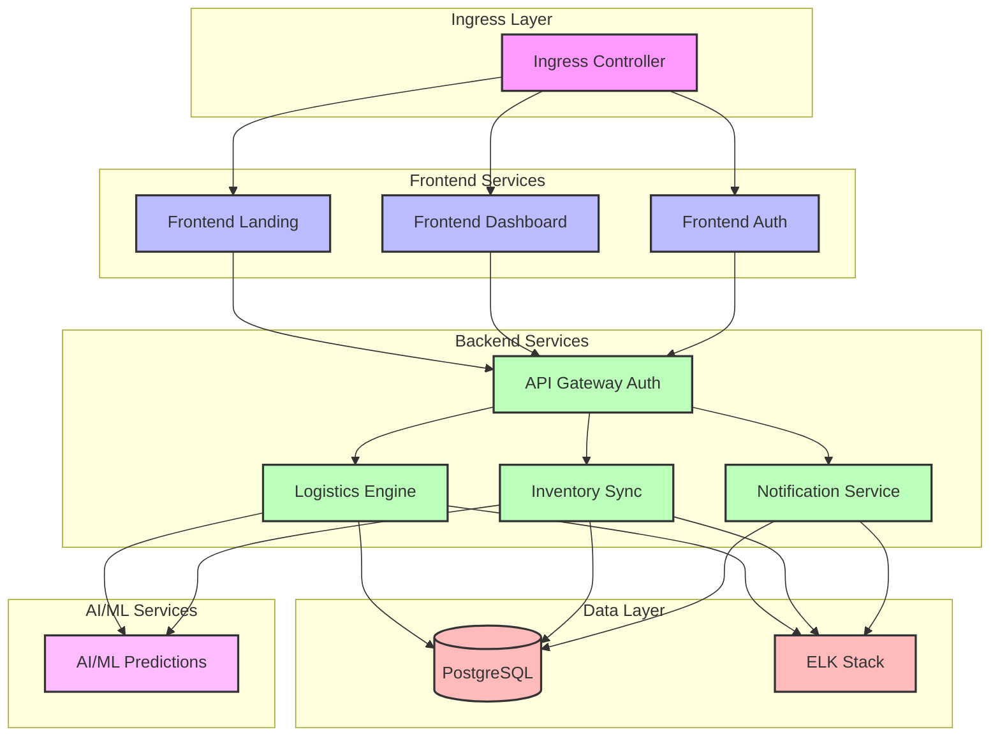

# Kubernetes Architecture

## Architecture Components

### Ingress Layer
- **Ingress Controller**: Manages external access to services, handles SSL termination, and routes traffic

### Frontend Services
- **Frontend Landing**: Public-facing landing page
- **Frontend Dashboard**: Main application dashboard
- **Frontend Auth**: Authentication interface

### Backend Services
- **Logistics Engine**: Core business logic and orchestration
- **Inventory Sync**: Real-time inventory management
- **Notification Service**: Event-driven notifications
- **API Gateway Auth**: Authentication and authorization gateway

### Data Layer
- **PostgreSQL**: Primary database
- **ELK Stack**: Logging and monitoring

### AI/ML Services
- **AI/ML Predictions**: Machine learning and predictive analytics

## Key Features
- Horizontal scaling of services
- Load balancing
- Service discovery
- Health monitoring
- Automated deployments
- Resource management
- High availability 