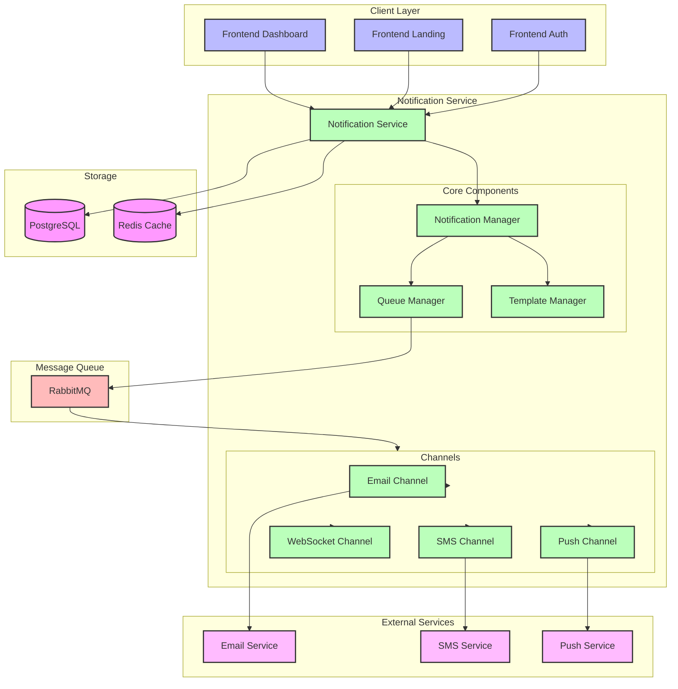

# Notification Service Architecture

## Architecture Components

### Client Layer
- **Frontend Dashboard**: Main application interface
- **Frontend Landing**: Public-facing interface
- **Frontend Auth**: Authentication interface

### Notification Service Core
- **Notification Manager**: Orchestrates notification processing
- **Queue Manager**: Handles message queuing and distribution
- **Template Manager**: Manages notification templates

### Notification Channels
- **Email Channel**: Email notifications
- **SMS Channel**: Text message notifications
- **WebSocket Channel**: Real-time notifications
- **Push Channel**: Mobile push notifications

### Message Queue
- **RabbitMQ**: Message broker for async processing

### Storage
- **PostgreSQL**: Persistent storage for notifications
- **Redis Cache**: Caching layer for templates and configurations

### External Services
- **Email Service**: Email delivery service
- **SMS Service**: SMS delivery service
- **Push Service**: Push notification delivery service

## Key Features
- Real-time notification delivery
- Multi-channel support
- Template-based notifications
- Asynchronous processing
- High availability
- Scalable architecture
- Message persistence
- Delivery tracking
- Rate limiting
- Retry mechanisms 