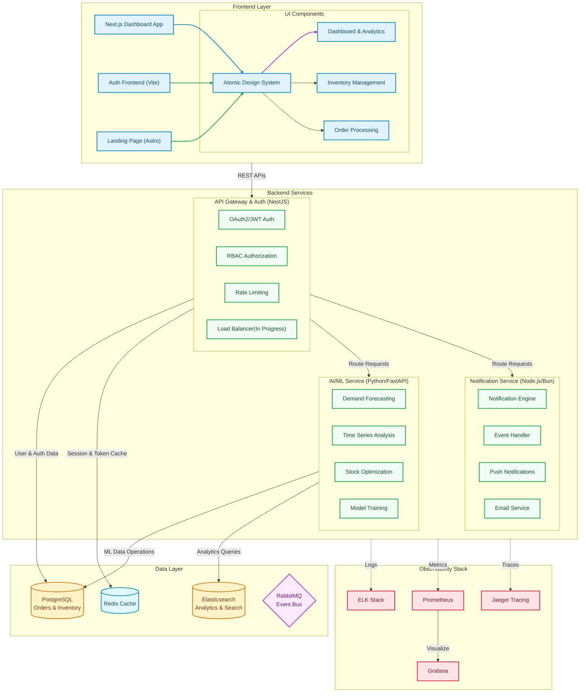
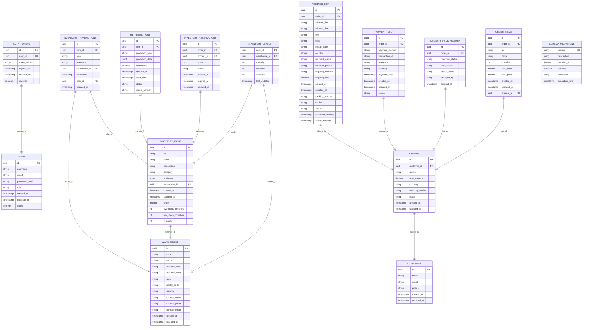
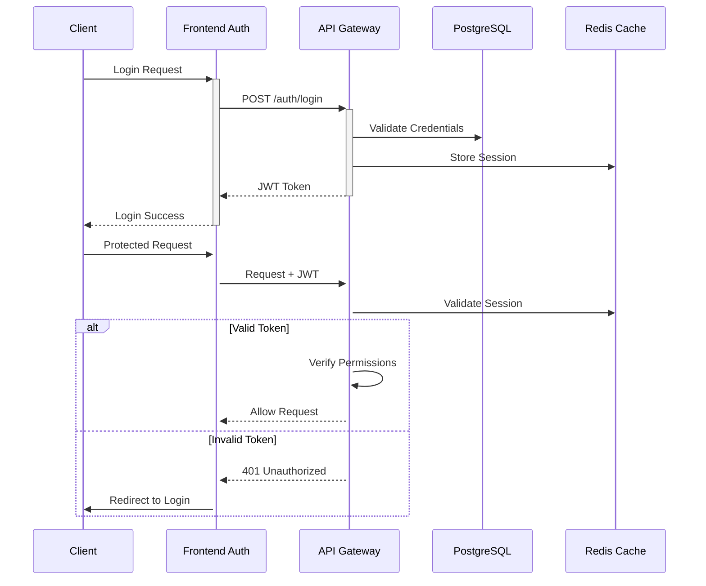
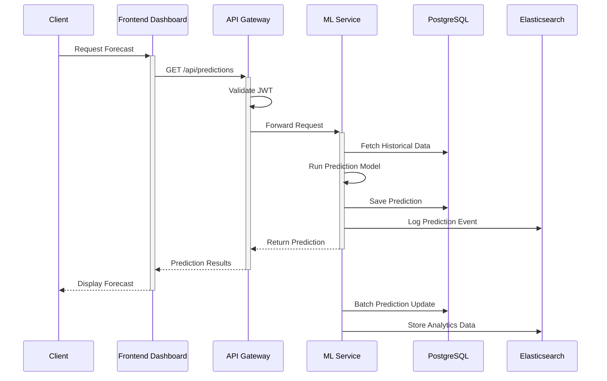
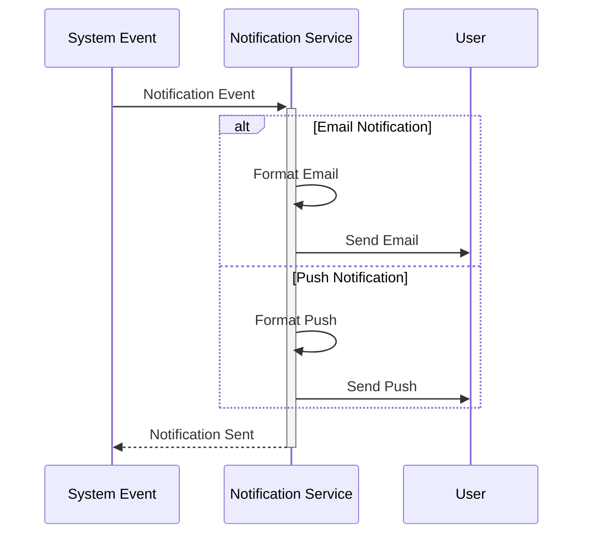
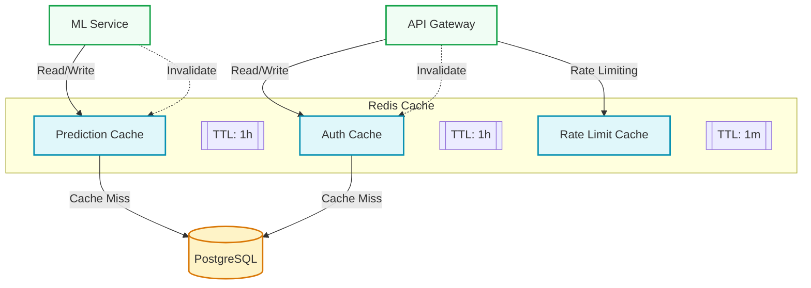
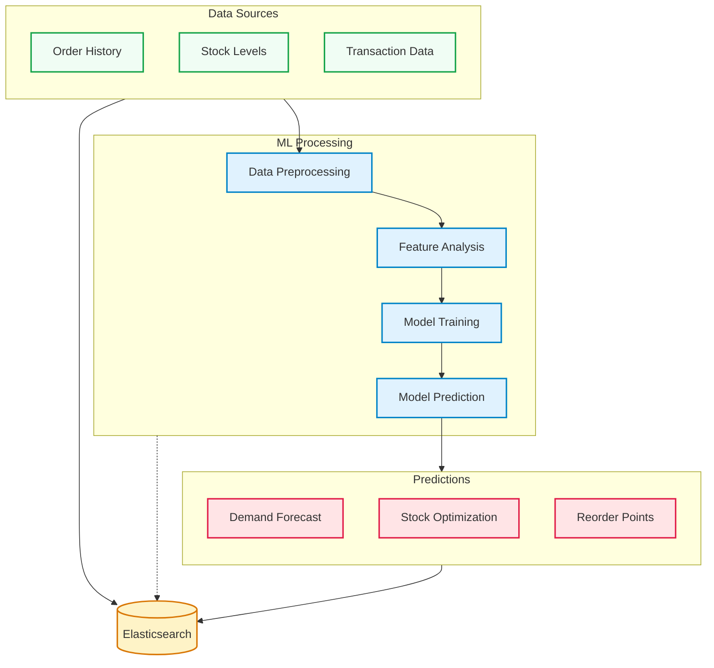

# Synkro System Architecture

## Overview

Synkro is a comprehensive microservice-based application designed with a modern cloud-native architecture. The system consists of several interconnected services that communicate with each other through well-defined APIs, event-driven patterns, and container orchestration. This document provides a detailed description of the architecture, service interactions, and technical implementation details based on the current system implementation.

## Architecture Diagram

## System Components

The Synkro system is divided into the following key components:

### Frontend Layer

1. **Frontend Dashboard** (`frontend-dashboard`)
   - Next.js application for the main interface
   - Implements Atomic Design principles
   - Uses TailwindCSS with Neobrutalism design
   - Protected routes with authentication
   - Key interfaces:
     - Dashboard & Analytics UI
     - Inventory Management UI
     - Order Processing UI

2. **Frontend Auth** (`frontend-auth`)
   - Vite-based authentication frontend
   - Handles user login and registration flows
   - Secure token storage and management
   - Integration with API Gateway Auth
   - Responsive design with Tailwind CSS

3. **Frontend Landing** (`frontend-landing`)
   - Astro-based landing page
   - Fast, static site generation
   - Marketing and product information
   - Seamless transition to authentication flow
   - Optimized for performance and SEO

### Backend Services

1. **API Gateway Auth** (`api-gateway-auth`)
   - NestJS application serving as the authentication gateway
   - OAuth2/JWT-based authentication and authorization
   - RBAC (Role-Based Access Control)
   - Rate limiting and API security 
   - API proxy and load balancing
   - Connects to PostgreSQL for user data

2. **Notification Service** (`notification-service`) (In Progress)
   - Lightweight Node.js/Bun-based notification system
   - Event-driven architecture
   - Notification engine for orchestration
   - Event queue handler
   - Multiple notification channels:
     - Push notifications
     - Email service

3. **AI/ML Service** (`ai-ml-predictions`)
   - Python-based prediction service with FastAPI
   - Demand forecasting models
   - Time series analysis
   - Stock level optimization
   - Model training and validation
   - Direct PostgreSQL integration for data access

### Data Layer

1. **PostgreSQL**
   - Primary database for orders and inventory
   - User authentication data
   - ML model data and predictions
   - Schema migrations and data versioning

2. **Redis**
   - Caching layer
   - Session management
   - Authentication token storage
   - Rate limiting implementation

3. **Elasticsearch**
   - Analytics and search capabilities
   - ML service data storage
   - Log aggregation and analysis
   - Part of the ELK stack for observability

### Observability Stack

1. **ELK Stack**
   - Elasticsearch for log storage and indexing
   - Logstash for log processing and transformation
   - Kibana for log visualization and dashboards
   - Centralized logging across all services

2. **Prometheus & Grafana**
   - Metrics collection and monitoring
   - Performance visualization
   - System health dashboards
   - Alerting capabilities

## Detailed Architecture

### Authentication Flow

1. **User Registration**:
   - User submits registration data to `frontend-auth`
   - Frontend validates and sends data to API Gateway Auth
   - API Gateway creates user record in PostgreSQL database
   - User credentials are securely stored (password hashed with bcrypt)
   - JWT token is generated and returned to the frontend
   - Frontend stores token securely

2. **User Login**:
   - User enters credentials in `frontend-auth`
   - Credentials are sent to API Gateway Auth
   - API validates credentials against database
   - Valid credentials lead to JWT token generation
   - Token is returned to frontend and stored securely

3. **Token Validation**:
   - Apps validate tokens by sending them to API Gateway Auth
   - API Gateway verifies token integrity and expiration
   - Invalidated tokens (from logout) are rejected
   - Validation results returned to requesting service

4. **Protected Routes**:
   - Dashboard routes are protected by middleware
   - Token is checked on both server-side (middleware.ts) and client-side
   - Unauthenticated users are redirected to login

### Service Communication

#### REST API Integration

1. **Frontend to Backend**
   - REST API communication
   - Authentication through API Gateway
   - Protected routes and endpoints
   - Standardized error handling and responses

#### Event-Driven Communication

1. **Notification Events**
   - Event-driven notification system
   - Multiple notification channels
   - Async processing of notification requests

### AI/ML Service Architecture

1. **Model Management**
   - Multiple prediction models available:
     - Demand forecasting
     - Stockout prediction
     - Stock optimization
   - Model versioning and selection
   - Dynamic model loading and prediction

2. **Data Processing**
   - Direct PostgreSQL integration
   - Time series data processing
   - Feature engineering and selection
   - Batch and real-time prediction capabilities

3. **API Integration**
   - FastAPI-based endpoints for predictions
   - Health and readiness checks
   - Input validation and error handling
   - Swagger documentation

## Entity Relationships

### Entity Relationships Description

1. **User Authentication**
   - `USERS` stores user account information
   - `AUTH_TOKENS` manages JWT tokens and sessions

2. **Inventory Management**
   - `INVENTORY_LEVELS` tracks the quantity of items in each warehouse
   - `INVENTORY_ITEMS` stores product information and thresholds
   - `WAREHOUSES` contains warehouse location and contact details
   - `INVENTORY_RESERVATIONS` manages temporary item holds
   - `INVENTORY_TRANSACTIONS` records all inventory movements

3. **ML Predictions**
   - `ML_PREDICTIONS` stores AI/ML model outputs
   - Connected to inventory items for demand forecasting
   - Tracks model confidence and version

4. **Order Management**
   - `ORDERS` stores main order information
   - `ORDER_ITEMS` contains individual items in each order
   - `ORDER_STATUS_HISTORY` tracks order status changes
   - `CUSTOMERS` stores customer information
   - `PAYMENT_INFO` manages payment details
   - `SHIPPING_INFO` handles shipping details

5. **Database Management**
   - `SCHEMA_MIGRATIONS` tracks database schema changes

### Key Relationships

- Authentication tokens linked to specific users
- ML predictions associated with inventory items
- Each inventory item belongs to a warehouse
- Inventory levels are tracked per item per warehouse
- Orders contain multiple order items
- Each order has associated payment and shipping information
- Order status changes are tracked historically
- Inventory transactions record all stock movements
- Inventory reservations temporarily hold stock for orders

## Detailed System Communications

### Authentication Flow

### ML Service Prediction Flow

### Notification Flow

### Cache Strategy Flow

### ML Service Data Flow

These diagrams provide detailed insights into:
1. Authentication and authorization flow
2. ML service prediction processes
3. Notification service event handling
4. Cache strategy with TTLs and invalidation
5. ML service data processing and predictions

Each diagram uses consistent color coding and styling to maintain readability and shows the specific interactions between services, including:
- Synchronous communications (REST)
- Caching strategies (Redis)
- Data persistence (PostgreSQL)
- Analytics and ML processing (Elasticsearch)

## Kubernetes Deployment

The Synkro system is deployed using Kubernetes for container orchestration, providing:

- Scalability through replica management
- High availability with multi-pod deployments
- Resource allocation and limits
- Health monitoring and self-healing
- Service discovery and load balancing

Each service is configured with:
- Appropriate resource requests and limits
- Health checks for liveness and readiness
- Proper service discovery through labels and selectors
- Namespace organization
- Persistent storage where needed

## Conclusion

The Synkro system architecture follows modern microservice principles with a focus on:

- Service independence through well-defined APIs
- Clear separation of concerns with specialized services
- High performance and scalability
- Comprehensive monitoring with the ELK stack
- Security-first approach with OAuth2/JWT
- Event-driven architecture for notifications
- AI/ML integration for predictive analytics
- Kubernetes-based deployment for orchestration

This architecture enables independent development, testing, and deployment of services while maintaining system cohesion through well-defined interfaces and protocols.