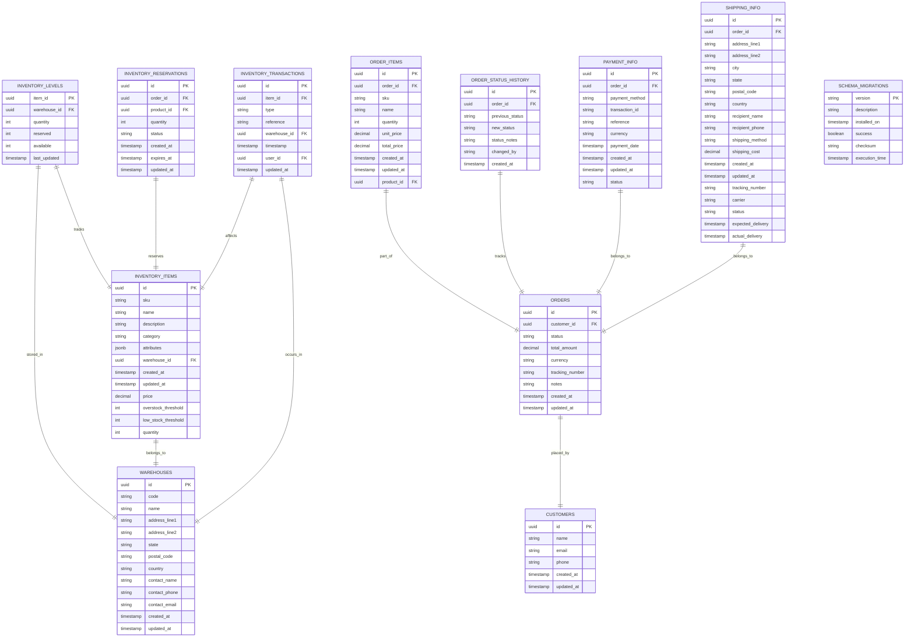

# Synkro System Architecture

## Overview

Synkro is a comprehensive microservice-based application designed with a modern cloud-native architecture. The system consists of several interconnected services that communicate with each other through well-defined APIs and gRPC protocols. This document provides a detailed description of the architecture, service interactions, and technical implementation details.

## Architecture Diagram

## System Components

The Synkro system is divided into the following key components:

### Frontend Layer

1. **Frontend Dashboard** (`frontend-dashboard`)
   - Next.js application for the main interface
   - Implements Atomic Design principles
   - Uses TailwindCSS with Neobrutalism design
   - Protected routes with authentication
   - Key interfaces:
     - Dashboard & Analytics UI
     - Inventory Management UI
     - Order Processing UI

### Backend Services

1. **API Gateway Auth** (`api-gateway-auth`)
   - NestJS application serving as the authentication gateway
   - OAuth2/JWT-based authentication and authorization
   - RBAC (Role-Based Access Control)
   - Rate limiting and API security
   - API proxy and load balancing
   - Connects to PostgreSQL for user data

2. **Logistics Engine** (`logistics-engine`)
   - Written in Rust for high performance
   - Order processing and validation
   - Inventory state management
   - Route optimization and delivery planning
   - gRPC client for inventory communication
   - Event publishing through RabbitMQ

3. **Inventory Sync Service** (`inventory-sync-service`)
   - Written in Go for concurrent operations
   - gRPC server (port 50052)
   - Stock management and allocation
   - Reservation and locking system
   - Real-time stock updates streaming
   - Event publishing through RabbitMQ

4. **Notification Service** (`notification-service`)
   - Node.js-based notification system
   - Event-driven architecture
   - Notification engine for orchestration
   - Event queue handler
   - Multiple notification channels:
     - Push notifications (FCM/APNS)
     - Email service (SMTP)

5. **AI/ML Service** (`ai-ml-predictions`)
   - Python-based prediction service
   - Demand forecasting models
   - Time series analysis
   - Stock level optimization
   - Model training and validation

### Data Layer

1. **PostgreSQL**
   - Primary database for orders and inventory
   - User authentication data
   - Transactional data storage

2. **Redis**
   - Caching layer
   - Session management
   - Real-time data storage

3. **Elasticsearch**
   - Analytics and search capabilities
   - ML service data storage
   - Log aggregation

4. **RabbitMQ**
   - Event bus for service communication
   - Message queue for async operations
   - Event sourcing backbone

### Observability Stack

1. **ELK Stack**
   - Centralized logging
   - Log analysis and visualization

2. **Prometheus**
   - Metrics collection
   - Performance monitoring

3. **Grafana**
   - Metrics visualization
   - Dashboard creation

4. **Jaeger**
   - Distributed tracing
   - Performance analysis

## Detailed Architecture

### Authentication Flow

1. **User Registration**:
   - User submits registration data to `frontend-auth`
   - Frontend validates and sends data to API Gateway Auth
   - API Gateway creates user record in PostgreSQL database
   - User credentials are securely stored (password hashed with bcrypt)
   - JWT token is generated and returned to the frontend
   - Frontend stores token in localStorage

2. **User Login**:
   - User enters credentials in `frontend-auth`
   - Credentials are sent to API Gateway Auth
   - API validates credentials against database
   - Valid credentials lead to JWT token generation
   - Token is returned to frontend and stored in localStorage

3. **Token Validation**:
   - Apps validate tokens by sending them to API Gateway Auth
   - API Gateway verifies token integrity and expiration
   - Invalidated tokens (from logout) are rejected
   - Validation results returned to requesting service

4. **Protected Routes**:
   - Dashboard routes are protected by middleware
   - Token is checked on both server-side (middleware.ts) and client-side
   - Unauthenticated users are redirected to login

### Service Communication

#### gRPC Integration

1. **Logistics Engine to Inventory Sync**
   - Bidirectional gRPC streaming
   - Key operations:
     - Stock reservation
     - Inventory updates
     - Stock release
   - Protocol Buffer definitions
   - Connection on port 50052

#### Event-Driven Communication

1. **RabbitMQ Events**
   - Order events from Logistics Engine
   - Stock updates from Inventory Sync
   - Notification events consumption
   - Async communication between services

#### REST/GraphQL APIs

1. **Frontend to Backend**
   - REST/GraphQL communication
   - Authentication through API Gateway
   - Protected routes and endpoints

## Entity Relationships

### Entity Relationships Description

1. **Inventory Management**
   - `INVENTORY_LEVELS` tracks the quantity of items in each warehouse
   - `INVENTORY_ITEMS` stores product information and thresholds
   - `WAREHOUSES` contains warehouse location and contact details
   - `INVENTORY_RESERVATIONS` manages temporary item holds
   - `INVENTORY_TRANSACTIONS` records all inventory movements

2. **Order Management**
   - `ORDERS` stores main order information
   - `ORDER_ITEMS` contains individual items in each order
   - `ORDER_STATUS_HISTORY` tracks order status changes
   - `CUSTOMERS` stores customer information
   - `PAYMENT_INFO` manages payment details
   - `SHIPPING_INFO` handles shipping details

3. **Database Management**
   - `SCHEMA_MIGRATIONS` tracks database schema changes

### Key Relationships

- Each inventory item belongs to a warehouse
- Inventory levels are tracked per item per warehouse
- Orders contain multiple order items
- Each order has associated payment and shipping information
- Order status changes are tracked historically
- Inventory transactions record all stock movements
- Inventory reservations temporarily hold stock for orders

## Conclusion

The Synkro system architecture follows modern microservice principles with a focus on:

- Service independence through gRPC and event-driven communication
- Clear separation of concerns with specialized services
- High performance with Rust and Go implementations
- Scalability through microservices architecture
- Comprehensive monitoring and observability
- Security-first approach with OAuth2/JWT
- Real-time capabilities with gRPC streaming
- Event-driven architecture using RabbitMQ
- AI/ML integration for predictive analytics

This architecture enables independent development, testing, and deployment of services while maintaining system cohesion through well-defined interfaces and protocols.