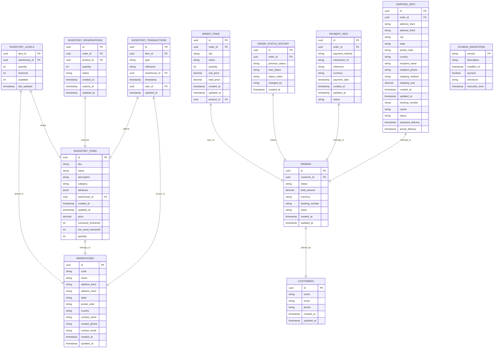

# Synkro System Architecture

## Overview

Synkro is a comprehensive microservice-based application designed with a modern cloud-native architecture. The system consists of several interconnected services that communicate with each other through well-defined APIs. This document provides a detailed description of the architecture, service interactions, and technical implementation details.

## Architecture Diagram

## System Components

The Synkro system is divided into the following key components:

### Frontend Services

1. **Frontend Auth** (`frontend-auth`)
   - Vue.js 3-based authentication interface
   - Responsible for user login, registration, and token validation
   - Communicates with the API Gateway Auth service
   - Implements client-side token management

2. **Frontend Landing** (`frontend-landing`)
   - Astro-powered landing page
   - Public-facing entry point for the application
   - Optimized for SEO and performance
   - Integrates with the authentication flow for user onboarding

3. **Frontend Dashboard** (`frontend-dashboard`)
   - Next.js application for authenticated users
   - Main user interface after authentication
   - Implements Module Federation for sharing components (currently disabled)
   - Protected by authentication middleware

### Backend Services

1. **API Gateway Auth** (`api-gateway-auth`)
   - NestJS application serving as the authentication gateway
   - Provides JWT-based authentication and authorization
   - Manages user registration, login, and token validation
   - Connects to PostgreSQL database for user data storage
   - Implements token invalidation and management

2. **Microservices** (referenced in configurations)
   - Notification Service: Handles notifications and alerts
   - Inventory Service: Manages inventory-related operations
   - AI/ML Service: Provides AI/ML capabilities

## Detailed Architecture

### Authentication Flow

1. **User Registration**:
   - User submits registration data to `frontend-auth`
   - Frontend validates and sends data to API Gateway Auth
   - API Gateway creates user record in PostgreSQL database
   - User credentials are securely stored (password hashed with bcrypt)
   - JWT token is generated and returned to the frontend
   - Frontend stores token in localStorage

2. **User Login**:
   - User enters credentials in `frontend-auth`
   - Credentials are sent to API Gateway Auth
   - API validates credentials against database
   - Valid credentials lead to JWT token generation
   - Token is returned to frontend and stored in localStorage

3. **Token Validation**:
   - Apps validate tokens by sending them to API Gateway Auth
   - API Gateway verifies token integrity and expiration
   - Invalidated tokens (from logout) are rejected
   - Validation results returned to requesting service

4. **Protected Routes**:
   - Dashboard routes are protected by middleware
   - Token is checked on both server-side (middleware.ts) and client-side
   - Unauthenticated users are redirected to login

### Service Communication

1. **Frontend to API Gateway**:
   - Frontend services communicate with API Gateway using REST APIs
   - Axios is used for HTTP requests with appropriate headers
   - Bearer token authentication is implemented on protected endpoints

2. **API Gateway to Microservices**:
   - NestJS Microservices module facilitates inter-service communication
   - TCP transport is used by default (configurable in env)
   - Service discovery is facilitated through environment variables

3. **Cross-Service Authentication**:
   - Auth tokens are validated across services
   - API Gateway serves as the central authority for authentication
   - Token validation endpoints are exposed for other services

## Technical Implementation

### Frontend Auth (Vue.js)

- **Technology Stack**:
  - Vue.js 3
  - Vue Router for navigation
  - Pinia for state management
  - Vite for build tooling
  - TailwindCSS for styling
  - TypeScript for type safety

- **Key Components**:
  - Authentication store for centralized auth state
  - Auth service for API communication
  - Protected route guards in router
  - Local storage token management

### Frontend Landing (Astro)

- **Technology Stack**:
  - Astro framework
  - Vue as integration
  - TailwindCSS for styling
  - TypeScript for type safety

- **Features**:
  - Static site generation for performance
  - Minimal JavaScript for faster loading
  - SEO optimizations
  - Seamless redirects to auth interface

### Frontend Dashboard (Next.js)

- **Technology Stack**:
  - Next.js React framework
  - Module Federation for microfrontend architecture
  - Shadcn UI components
  - TailwindCSS for styling
  - TypeScript for type safety

- **Features**:
  - Server-side rendering for performance
  - Client-side navigation for SPA experience
  - Module Federation for component sharing
  - JWT-based authentication integration

### API Gateway Auth (NestJS)

- **Technology Stack**:
  - NestJS framework
  - Fastify as HTTP provider
  - TypeORM for database interaction
  - PostgreSQL for data storage
  - JWT for authentication tokens
  - Winston for logging
  - Prometheus for monitoring

- **Key Features**:
  - Role-based access control
  - Token invalidation on logout
  - Token expiration management
  - Password hashing with bcrypt
  - Rate limiting for security
  - CSRF protection
  - Helmet integration for security headers

## Database Schema

### Users Table

- **id**: UUID (Primary Key)
- **email**: String (Unique)
- **password**: String (Hashed)
- **name**: String (Optional)
- **role**: Enum (USER, ADMIN)
- **isActive**: Boolean
- **createdAt**: DateTime
- **updatedAt**: DateTime

### Roles Table (Many-to-Many with Users)

- **id**: UUID (Primary Key)
- **name**: String
- **description**: String
- **permissions**: JSON

## Environment Configuration

Each service has its own `.env` file with service-specific configurations:

### API Gateway Auth

- Database connection details
- JWT secrets and expiration times
- Microservice connection information
- Rate limiting parameters
- Logging configuration
- Monitoring endpoints

### Frontend Services

- API endpoints
- Authentication token names
- Cross-service URLs
- Environment indicators

## Deployment Architecture

The system is designed for Kubernetes deployment:

1. **Containerization**:
   - Each service has its own Dockerfile
   - Dependencies are bundled in the container
   - Configuration through environment variables

2. **Kubernetes Resources**:
   - Deployments for service instances
   - Services for internal communication
   - Ingress for external access
   - ConfigMaps and Secrets for configuration

3. **Horizontal Scaling**:
   - Stateless services design
   - Database as external service
   - Shared nothing architecture

## Monitoring and Observability

- **Prometheus Integration**:
  - Metrics exposed by API Gateway
  - Custom metrics for business operations
  - Performance monitoring

- **Logging**:
  - Structured logging with Winston
  - Log aggregation with ELK stack
  - Configurable log levels

## Security Considerations

1. **Authentication**:
   - JWT-based authentication
   - Token invalidation mechanism
   - Password hashing with bcrypt

2. **API Security**:
   - CSRF protection
   - Rate limiting
   - Helmet security headers

3. **Data Protection**:
   - Sensitive data exclusion in responses
   - Database encryption options
   - HTTPS throughout

## Future Architecture Extensions

1. **Service Mesh**:
   - Istio integration for advanced networking
   - mTLS for service-to-service communication
   - Advanced traffic management

2. **API Gateway Enhancements**:
   - GraphQL integration
   - API versioning
   - Enhanced caching

3. **Microfrontend Evolution**:
   - Complete Module Federation implementation
   - Runtime component sharing
   - Independent deployment cycles

## Neobrutalism Design System

The frontend implements a neobrutalism design approach:

- Bold, chunky elements with high contrast
- Deliberate use of solid colors
- Intentionally "unrefined" UI elements
- Thick borders and shadows
- Playful typography

## Atomic Design Implementation

The system uses Atomic Design methodology:

1. **Atoms**: Basic UI elements (buttons, inputs, typography)
2. **Molecules**: Combinations of atoms (form fields, search bars)
3. **Organisms**: Complex UI components (navigation bars, forms)
4. **Templates**: Page layouts without specific content
5. **Pages**: Specific instances of templates with real data

## Entity Relationships

### Entity Relationships Description

1. **Inventory Management**
   - `INVENTORY_LEVELS` tracks the quantity of items in each warehouse
   - `INVENTORY_ITEMS` stores product information and thresholds
   - `WAREHOUSES` contains warehouse location and contact details
   - `INVENTORY_RESERVATIONS` manages temporary item holds
   - `INVENTORY_TRANSACTIONS` records all inventory movements

2. **Order Management**
   - `ORDERS` stores main order information
   - `ORDER_ITEMS` contains individual items in each order
   - `ORDER_STATUS_HISTORY` tracks order status changes
   - `CUSTOMERS` stores customer information
   - `PAYMENT_INFO` manages payment details
   - `SHIPPING_INFO` handles shipping details

3. **Database Management**
   - `SCHEMA_MIGRATIONS` tracks database schema changes

### Key Relationships

- Each inventory item belongs to a warehouse
- Inventory levels are tracked per item per warehouse
- Orders contain multiple order items
- Each order has associated payment and shipping information
- Order status changes are tracked historically
- Inventory transactions record all stock movements
- Inventory reservations temporarily hold stock for orders

## Conclusion

The Synkro system architecture follows modern microservice principles with a focus on:

- Service independence
- Clear communication boundaries
- Scalability and maintainability
- Security and performance
- Modern frontend architectures

This architecture enables independent development, testing, and deployment of services while maintaining system cohesion through well-defined interfaces.