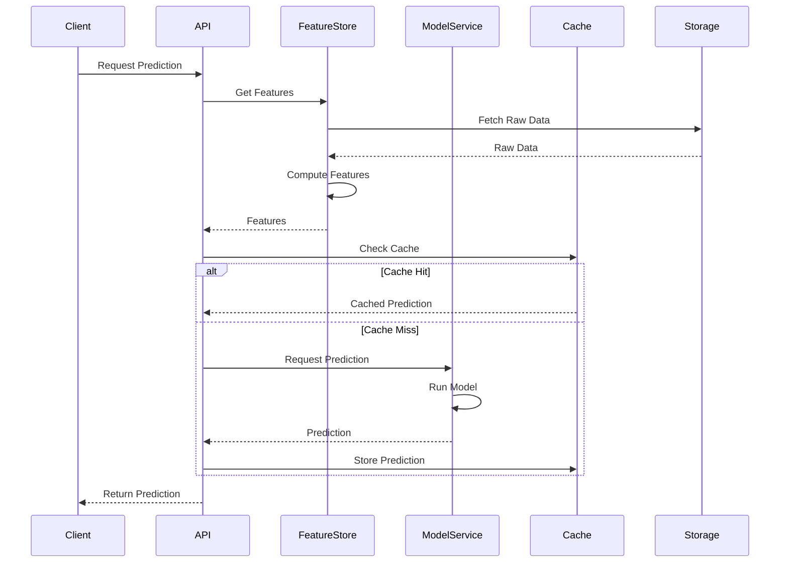

# Synkro AI/ML Predictions Service

## Overview

The AI/ML Predictions service is a Python-based microservice that provides machine learning capabilities for the Synkro platform. It offers real-time predictions, data analysis, and intelligent insights through a RESTful API. The service integrates with the Logistics Engine and Inventory Sync Service to provide predictive analytics for inventory management, demand forecasting, and optimization recommendations.

## Objectives

### Primary Objectives
1. **Demand Forecasting**
   - Predict future demand for products based on historical data
   - Account for seasonality and trends
   - Handle multi-variable forecasting
   - Support different time horizons (short-term, medium-term, long-term)

2. **Stock Level Optimization**
   - Calculate optimal stock levels for each warehouse
   - Consider lead times and supplier constraints
   - Balance holding costs vs stockout risks
   - Account for warehouse capacity constraints

3. **Stockout Prevention**
   - Predict potential stockout situations
   - Calculate probability of stockouts
   - Estimate impact on business operations
   - Provide early warning system

4. **Order Pattern Analysis**
   - Identify seasonal patterns in ordering
   - Detect anomalies in order behavior
   - Analyze customer segmentation
   - Track changes in ordering patterns

5. **Business Intelligence**
   - Generate actionable insights
   - Provide recommendation explanations
   - Support decision-making processes
   - Enable what-if scenario analysis

### Technical Objectives
1. **Scalable ML Deployment**
   - Containerized model deployment
   - Horizontal scaling capabilities
   - Load balancing across instances
   - Resource optimization

2. **Real-time Processing**
   - Sub-second prediction latency
   - Stream processing capabilities
   - Event-driven architecture
   - Efficient data pipeline

3. **High Reliability**
   - Model performance monitoring
   - Automated model retraining
   - Fallback mechanisms
   - Data quality checks

4. **Model Flexibility**
   - Support for multiple algorithms
   - Easy model swapping
   - A/B testing capabilities
   - Custom model integration

5. **Version Management**
   - Model versioning
   - Feature versioning
   - Configuration management
   - Rollback capabilities

## Machine Learning Models

### 1. Demand Forecasting Model
- **Algorithm**: LightGBM with time series features
- **Input Features**:
  - Historical sales data
  - Seasonal indicators
  - Price information
  - Marketing events
  - External factors (weather, holidays)
- **Output**: Predicted demand for next N periods
- **Performance Metrics**:
  - MAPE (Mean Absolute Percentage Error)
  - RMSE (Root Mean Square Error)
  - MAE (Mean Absolute Error)

### 2. Stock Optimization Model
- **Algorithm**: Mixed Integer Linear Programming
- **Input Parameters**:
  - Holding costs
  - Transportation costs
  - Lead times
  - Warehouse capacities
  - Service level targets
- **Output**: 
  - Optimal stock levels
  - Reorder points
  - Safety stock levels
- **Constraints**:
  - Budget limitations
  - Space constraints
  - Service level requirements

### 3. Stockout Prediction Model
- **Algorithm**: XGBoost Classifier
- **Features**:
  - Current stock levels
  - Historical stockout events
  - Lead time variability
  - Demand volatility
  - Supplier reliability
- **Output**: 
  - Stockout probability
  - Time until stockout
  - Impact severity

### 4. Pattern Recognition Model
- **Algorithm**: LSTM Neural Network
- **Input Data**:
  - Order sequences
  - Customer behavior
  - Temporal patterns
  - Product associations
- **Output**:
  - Pattern classifications
  - Trend indicators
  - Anomaly scores

## Technical Architecture

### Component Details

#### 1. API Layer
- FastAPI framework
- OpenAPI documentation
- Request validation
- Rate limiting
- Authentication middleware

#### 2. Feature Store
- Real-time feature computation
- Feature versioning
- Feature caching
- Online/offline feature serving
- Feature validation

#### 3. Model Registry
- Model metadata storage
- Version control
- A/B test configurations
- Model artifacts
- Deployment history

#### 4. Prediction Service
- Model serving
- Prediction caching
- Batch prediction
- Real-time prediction
- Model chaining

#### 5. Training Pipeline
- Data validation
- Feature engineering
- Model training
- Hyperparameter optimization
- Cross-validation

#### 6. Monitoring System
- Model performance tracking
- Data drift detection
- Resource utilization
- Error tracking
- Alert system

## Data Flow



## API Specification

### Prediction Endpoints

#### POST /api/v1/predictions/demand
Request:
```json
{
  "product_id": "string",
  "warehouse_id": "string",
  "horizon": "int",
  "granularity": "string",
  "features": {
    "historical_sales": "array",
    "price_data": "object",
    "events": "array"
  }
}
```
Response:
```json
{
  "predictions": [
    {
      "timestamp": "string",
      "value": "float",
      "confidence_interval": {
        "lower": "float",
        "upper": "float"
      }
    }
  ],
  "model_version": "string",
  "model_metrics": {
    "mape": "float",
    "rmse": "float"
  }
}
```

[Similar detailed specifications for other endpoints...]

## Development Setup

### Project Structure
```
ai-ml-predictions/
├── app/
│   ├── api/
│   │   ├── routes/
│   │   ├── middleware/
│   │   └── dependencies/
│   ├── core/
│   │   ├── config/
│   │   ├── security/
│   │   └── logging/
│   ├── models/
│   │   ├── training/
│   │   ├── inference/
│   │   └── evaluation/
│   ├── services/
│   │   ├── feature_store/
│   │   ├── model_registry/
│   │   └── cache/
│   └── utils/
├── tests/
│   ├── unit/
│   ├── integration/
│   └── e2e/
├── notebooks/
├── scripts/
└── configs/
```

## Development Plan

### Phase 1: Foundation (Week 1-2)
- [ ] Set up project structure and dependencies
- [ ] Implement basic API endpoints
- [ ] Configure database connections
- [ ] Set up model registry
- [ ] Implement logging and monitoring
- [ ] Configure Kubernetes deployment

### Phase 2: Core ML Features (Week 3-4)
- [ ] Implement demand forecasting models
- [ ] Develop stock optimization algorithms
- [ ] Create stockout prediction models
- [ ] Set up model training pipeline
- [ ] Implement model versioning

### Phase 3: Integration (Week 5-6)
- [ ] Integrate with Logistics Engine
- [ ] Connect with Inventory Sync Service
- [ ] Implement real-time data processing
- [ ] Set up event-driven predictions
- [ ] Create data synchronization jobs

### Phase 4: Advanced Features (Week 7-8)
- [ ] Implement A/B testing framework
- [ ] Add model performance monitoring
- [ ] Create automated retraining pipeline
- [ ] Implement feature store
- [ ] Add model explainability tools

### Phase 5: Optimization (Week 9-10)
- [ ] Optimize model inference
- [ ] Implement caching strategies
- [ ] Add batch prediction capabilities
- [ ] Optimize resource usage
- [ ] Implement load balancing

## Architecture

```mermaid
graph TB
    Client[API Gateway] --> Service[AI/ML Service]
    Service --> ModelRegistry[Model Registry]
    Service --> FeatureStore[Feature Store]
    Service --> Cache[Prediction Cache]
    
    subgraph ML Pipeline
        Training[Training Pipeline]
        Inference[Inference Pipeline]
        Monitoring[Model Monitoring]
    end
    
    Service --> ML Pipeline
    
    subgraph Data Sources
        Inventory[Inventory Data]
        Orders[Order Data]
        Logistics[Logistics Data]
    end
    
    Data Sources --> Service
```

## Technical Stack

### Core Technologies
- Python 3.11+
- FastAPI for API development
- PostgreSQL for data storage
- Redis for caching
- MLflow for model registry
- Kubernetes for orchestration

### ML Framework
- PyTorch for deep learning
- Scikit-learn for traditional ML
- Pandas for data processing
- NumPy for numerical computations

### Monitoring & Logging
- Prometheus for metrics
- ELK Stack for logging
- MLflow for model tracking
- Grafana for visualization

## API Endpoints

### Prediction Endpoints
- `POST /api/v1/predictions/demand` - Get demand predictions
- `POST /api/v1/predictions/stockout` - Predict stockout probability
- `POST /api/v1/predictions/optimize` - Get optimization recommendations

### Model Management
- `GET /api/v1/models` - List available models
- `GET /api/v1/models/{model_id}` - Get model details
- `POST /api/v1/models/train` - Trigger model training
- `POST /api/v1/models/deploy` - Deploy model to production

### Monitoring
- `GET /api/v1/health` - Service health check
- `GET /api/v1/metrics` - Service metrics
- `GET /api/v1/models/performance` - Model performance metrics

## Development Setup

### Prerequisites
- Python 3.11+
- Docker
- Kubernetes cluster
- PostgreSQL
- Redis

### Installation
```bash
# Create virtual environment
python -m venv venv
source venv/bin/activate  # Linux/Mac
.\venv\Scripts\activate   # Windows

# Install dependencies
pip install -r requirements.txt

# Set up environment variables
cp .env.example .env

# Run development server
uvicorn app.main:app --reload
```

### Environment Variables
```
# Server Configuration
PORT=3003
NODE_ENV=development
LOG_LEVEL=debug

# Database Configuration
DB_HOST=localhost
DB_PORT=5432
DB_NAME=ai_ml_predictions
DB_USER=postgres
DB_PASSWORD=postgres

# Redis Configuration
REDIS_HOST=localhost
REDIS_PORT=6379

# Model Registry
MLFLOW_TRACKING_URI=http://localhost:5000

# Service Integration
LOGISTICS_ENGINE_URL=http://localhost:5050
INVENTORY_SYNC_URL=http://localhost:5051
```

## Deployment

### Docker
```bash
# Build image
docker build -t synkro/ai-ml-predictions .

# Run container
docker run -p 3003:3003 synkro/ai-ml-predictions
```

### Kubernetes
```bash
# Apply configuration
kubectl apply -f k8s-deployment.yaml
```

## Testing

```bash
# Run unit tests
pytest tests/unit

# Run integration tests
pytest tests/integration

# Run all tests with coverage
pytest --cov=app tests/
```

## Monitoring

The service exposes the following metrics:

- Model prediction latency
- Prediction accuracy
- Model version information
- Resource utilization
- Cache hit/miss rates
- Error rates and types

## Security

- JWT-based authentication
- Rate limiting
- Input validation
- Model access control
- Data encryption at rest
- Secure model storage

## Contributing

1. Fork the repository
2. Create a feature branch
3. Commit your changes
4. Push to the branch
5. Create a Pull Request

## License

This project is licensed under the MIT License. 