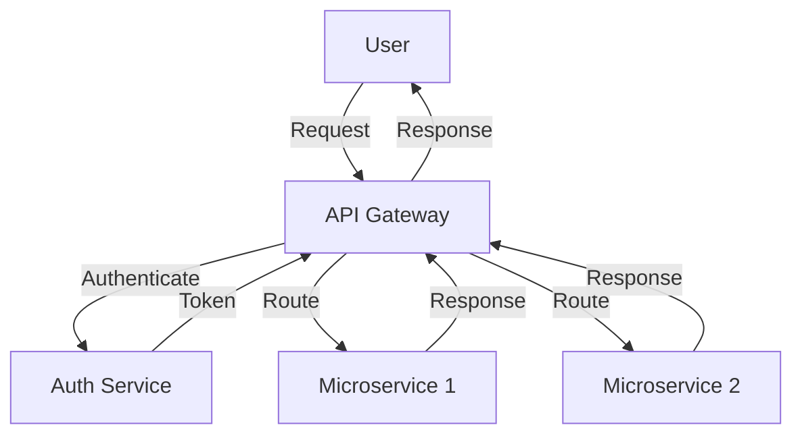

# Development Plan for API Gateway Auth

## Step 1: Setup Project Structure
- **Project Initialization**:
  - Use the Nest CLI to scaffold a new project: `nest new api-gateway-auth`.
  - Choose Fastify as the HTTP adapter for its performance benefits: `npm install @nestjs/platform-fastify`.

- **Directory Structure**:
  - Organize the project using a modular approach:
    - `src/`
      - `modules/`: Contains feature modules like `auth`, `user`, `routing`.
      - `common/`: Shared utilities, guards, interceptors, and pipes.
      - `config/`: Configuration files for different environments.
      - `main.ts`: Entry point of the application.

- **Environment Configuration**:
  - Use `@nestjs/config` for environment management.
  - Create `.env` files for `development`, `staging`, and `production`.

## Step 2: Implement Authentication
- **JWT Authentication**:
  - Install `@nestjs/jwt` and `passport-jwt` for token management.
  - Create an `AuthModule` with services for login, registration, and token validation.
  - Implement `JwtStrategy` for validating JWT tokens.

- **User Service**:
  - Create a `UserModule` to handle user-related operations.
  - Implement services for user registration, login, and profile management.
  - Use a database like PostgreSQL for storing user data, with `TypeORM` for ORM.

- **Role-Based Access Control**:
  - Define roles and permissions in a `roles` table.
  - Implement guards to check user roles before accessing certain routes.

## Step 3: Develop API Gateway Features
- **Request Routing**:
  - Use `@nestjs/microservices` to handle different protocols (REST, GraphQL, WebSockets).
  - Implement a `RoutingModule` to manage incoming requests and direct them to appropriate services.

- **Rate Limiting**:
  - Use `nestjs-rate-limiter` to prevent abuse.
  - Configure middleware to apply rate limits based on IP or user ID.

- **Load Balancing**:
  - Use a reverse proxy like Nginx or a cloud provider's load balancer to distribute traffic.

## Step 4: Security Enhancements
- **HTTPS and Security Headers**:
  - Use `@nestjs/helmet` to set security headers.
  - Configure Fastify to use HTTPS with SSL certificates.

- **Vulnerability Protection**:
  - Implement CSRF protection using `@nestjs/csrf`.
  - Regularly update dependencies to patch known vulnerabilities.

## Step 5: Logging and Monitoring
- **Centralized Logging**:
  - Use `@nestjs/winston` for logging.
  - Send logs to an ELK stack for centralized management.

- **Monitoring and Alerts**:
  - Integrate Prometheus for metrics collection.
  - Use Grafana for visualizing metrics and setting up alerts.

## Step 6: Testing and Deployment
- **Testing**:
  - Write unit tests using `@nestjs/testing`.
  - Use `supertest` for integration tests.

- **CI/CD Pipeline**:
  - Use GitHub Actions or Jenkins for automated testing and deployment.
  - Deploy using Docker containers orchestrated by Kubernetes.

## Step 7: Documentation
- **Developer Documentation**:
  - Use tools like Swagger for API documentation.
  - Maintain a `docs/` directory with detailed guides and architecture diagrams.

- **Mermaid.js Diagrams**:
  - Use Mermaid.js to create visual representations of the architecture and workflows.

