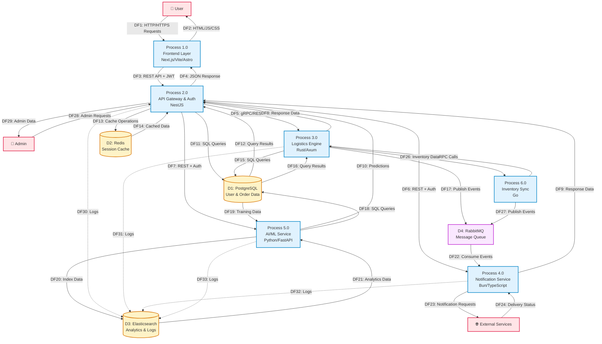
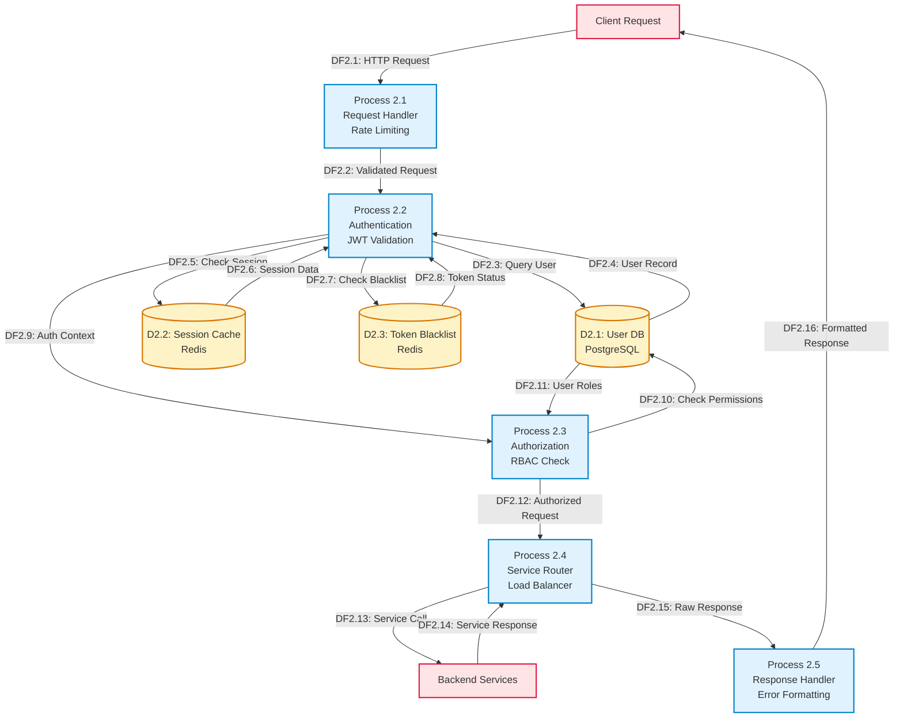
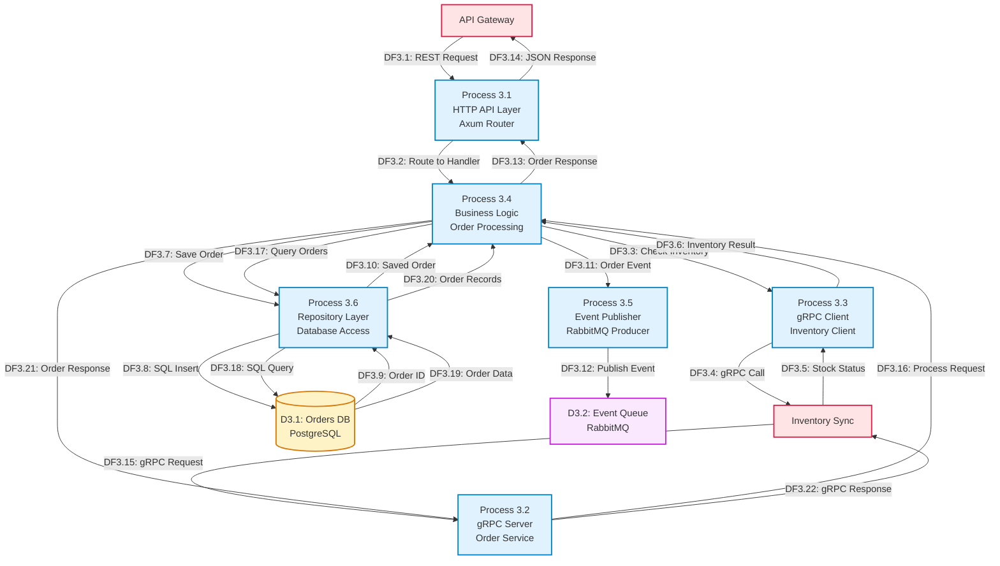
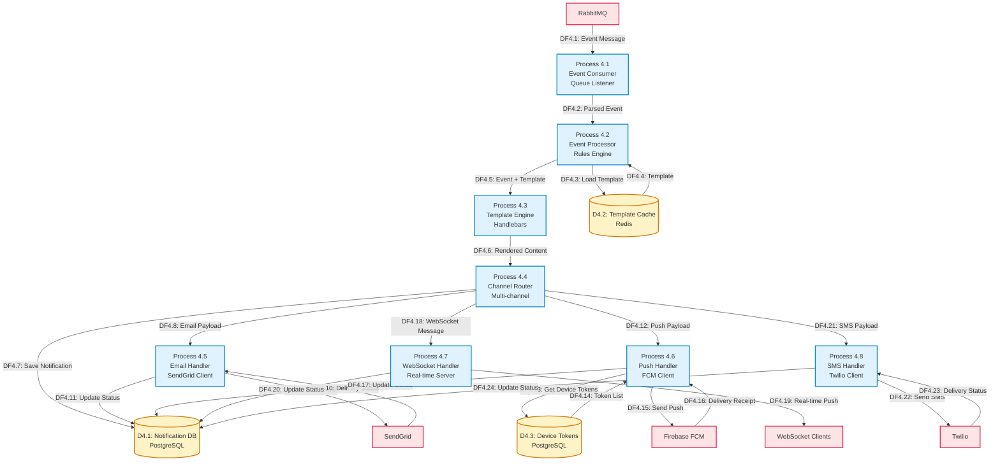
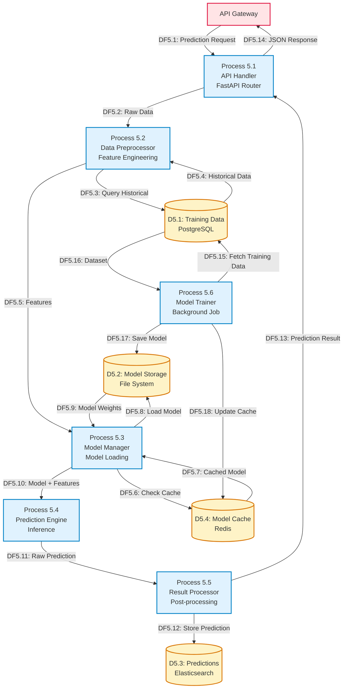

# Synkro - Data Flow Diagram for Threat Modeling

## Executive Summary

This document provides a comprehensive Data Flow Diagram (DFD) analysis for the Synkro inventory management system, following threat modeling best practices. The analysis uses the STRIDE methodology to identify potential security threats across all system components.

## Table of Contents

1. [System Scope & Boundaries](#system-scope--boundaries)
2. [Context Diagram (Level 0)](#context-diagram-level-0)
3. [System Architecture DFD (Level 1)](#system-architecture-dfd-level-1)
4. [Detailed Component DFDs (Level 2)](#detailed-component-dfds-level-2)
5. [STRIDE Threat Analysis](#stride-threat-analysis)
6. [Risk Assessment & Mitigation](#risk-assessment--mitigation)

---

## System Scope & Boundaries

### In Scope
- Frontend applications (Landing, Auth, Dashboard)
- API Gateway & Authentication Service
- Backend microservices (Logistics Engine, Notification Service, Inventory Sync)
- AI/ML Prediction Service
- Data stores (PostgreSQL, Redis, Elasticsearch)
- Message queue (RabbitMQ)
- Observability stack (ELK)
- Kubernetes orchestration layer

### Out of Scope
- External payment processors (referenced but not implemented)
- External SMS/Email providers (SendGrid, Twilio, FCM)
- Cloud infrastructure provider security
- Physical security
- End-user device security

### Trust Boundaries

```
┌─────────────────────────────────────────────────────────────┐
│ EXTERNAL (Untrusted)                                        │
│ - End Users                                                 │
│ - External APIs                                             │
│ - Mobile Apps                                               │
└─────────────────────────────────────────────────────────────┘
                            ↓
┌─────────────────────────────────────────────────────────────┐
│ DMZ / INGRESS LAYER (Semi-Trusted)                         │
│ - Ingress Controller                                        │
│ - Load Balancer                                             │
│ - TLS Termination                                           │
└─────────────────────────────────────────────────────────────┘
                            ↓
┌─────────────────────────────────────────────────────────────┐
│ APPLICATION LAYER (Trusted)                                 │
│ - Frontend Services                                         │
│ - API Gateway                                               │
│ - Backend Microservices                                     │
└─────────────────────────────────────────────────────────────┘
                            ↓
┌─────────────────────────────────────────────────────────────┐
│ DATA LAYER (Highly Trusted)                                │
│ - PostgreSQL                                                │
│ - Redis                                                     │
│ - Elasticsearch                                             │
└─────────────────────────────────────────────────────────────┘
```

---

## Context Diagram (Level 0)

```mermaid
graph TB
    %% External Entities
    USER[👤 End User<br/>External Entity]
    ADMIN[👤 Admin User<br/>External Entity]
    MOBILE[📱 Mobile App<br/>External Entity]
    EXT_API[🌐 External API Client<br/>External Entity]
    EMAIL_SVC[📧 SendGrid<br/>External Service]
    PUSH_SVC[📲 Firebase FCM<br/>External Service]
    SMS_SVC[📱 Twilio<br/>External Service]
    
    %% Main System
    SYNKRO[🏢 Synkro System<br/>Process 0]
    
    %% Data Flows - User Interactions
    USER -->|1.1: Login Credentials| SYNKRO
    USER -->|1.2: Registration Data| SYNKRO
    USER -->|1.3: Inventory Queries| SYNKRO
    USER -->|1.4: Order Requests| SYNKRO
    SYNKRO -->|1.5: JWT Token| USER
    SYNKRO -->|1.6: Dashboard Data| USER
    SYNKRO -->|1.7: Order Confirmation| USER
    
    %% Admin Interactions
    ADMIN -->|2.1: Admin Credentials| SYNKRO
    ADMIN -->|2.2: System Config| SYNKRO
    SYNKRO -->|2.3: Analytics Reports| ADMIN
    SYNKRO -->|2.4: System Logs| ADMIN
    
    %% Mobile App Interactions
    MOBILE -->|3.1: API Requests + JWT| SYNKRO
    SYNKRO -->|3.2: JSON Responses| MOBILE
    SYNKRO -->|3.3: Push Notifications| MOBILE
    
    %% External API Interactions
    EXT_API -->|4.1: API Key + Requests| SYNKRO
    SYNKRO -->|4.2: Inventory Data| EXT_API
    SYNKRO -->|4.3: Order Status| EXT_API
    
    %% External Service Interactions
    SYNKRO -->|5.1: Email Requests| EMAIL_SVC
    EMAIL_SVC -->|5.2: Delivery Status| SYNKRO
    SYNKRO -->|6.1: Push Notification Payload| PUSH_SVC
    PUSH_SVC -->|6.2: Delivery Receipt| SYNKRO
    SYNKRO -->|7.1: SMS Requests| SMS_SVC
    SMS_SVC -->|7.2: Delivery Status| SYNKRO
    
    %% Styling
    classDef external fill:#ffcccc,stroke:#cc0000,stroke-width:3px
    classDef system fill:#ccffcc,stroke:#00cc00,stroke-width:3px
    classDef service fill:#ccccff,stroke:#0000cc,stroke-width:3px
    
    class USER,ADMIN,MOBILE,EXT_API external
    class SYNKRO system
    class EMAIL_SVC,PUSH_SVC,SMS_SVC service
```



### Level 0 Data Flow Description

| Flow ID | Source | Destination | Data | Protocol | Trust Boundary Crossed |
|---------|--------|-------------|------|----------|----------------------|
| 1.1 | End User | Synkro | Username, Password | HTTPS | Yes (External → DMZ) |
| 1.2 | End User | Synkro | Email, Password, Name | HTTPS | Yes (External → DMZ) |
| 1.3 | End User | Synkro | Search queries, Filters | HTTPS | Yes (External → DMZ) |
| 1.4 | End User | Synkro | Order details, Items | HTTPS | Yes (External → DMZ) |
| 1.5 | Synkro | End User | JWT Token | HTTPS | Yes (DMZ → External) |
| 1.6 | Synkro | End User | Inventory, Analytics | HTTPS | Yes (DMZ → External) |
| 1.7 | Synkro | End User | Order ID, Status | HTTPS | Yes (DMZ → External) |
| 2.1-2.4 | Admin | Synkro | Admin operations | HTTPS | Yes (External → DMZ) |
| 3.1-3.3 | Mobile App | Synkro | API calls, Notifications | HTTPS/WSS | Yes (External → DMZ) |
| 4.1-4.3 | External API | Synkro | API operations | HTTPS | Yes (External → DMZ) |
| 5.1-7.2 | Synkro | External Services | Notification data | HTTPS | Yes (DMZ → External) |

---

## System Architecture DFD (Level 1)



### Level 1 Data Flow Description

| Flow ID | Source | Destination | Data Elements | Sensitivity | Encryption |
|---------|--------|-------------|---------------|-------------|------------|
| DF1 | User | Frontend | HTTP requests, form data | Medium | TLS 1.3 |
| DF2 | Frontend | User | HTML, CSS, JS, images | Low | TLS 1.3 |
| DF3 | Frontend | API Gateway | JWT, API requests, JSON | High | TLS 1.3 |
| DF4 | API Gateway | Frontend | JSON responses, errors | Medium | TLS 1.3 |
| DF5 | API Gateway | Logistics | gRPC calls, auth context | High | mTLS |
| DF6 | API Gateway | Notification | REST calls, auth context | Medium | TLS 1.3 |
| DF7 | API Gateway | AI/ML | REST calls, data queries | Medium | TLS 1.3 |
| DF11-12 | API Gateway | PostgreSQL | SQL queries, user data | High | TLS + encrypted at rest |
| DF13-14 | API Gateway | Redis | Session tokens, cache | High | TLS + encrypted at rest |
| DF15-16 | Logistics | PostgreSQL | Order data, inventory | High | TLS + encrypted at rest |
| DF17 | Logistics | RabbitMQ | Order events, JSON | Medium | TLS 1.3 |
| DF18-19 | AI/ML | PostgreSQL | Historical data | Medium | TLS + encrypted at rest |
| DF20-21 | AI/ML | Elasticsearch | Predictions, analytics | Medium | TLS 1.3 |
| DF22 | RabbitMQ | Notification | Event messages | Medium | TLS 1.3 |
| DF23 | Notification | External | Email, SMS, push data | High | TLS 1.3 |
| DF25-26 | Inventory Sync | Logistics | gRPC inventory calls | High | mTLS |
| DF30-33 | All Services | Elasticsearch | Application logs | Low-Medium | TLS 1.3 |

---

## Detailed Component DFDs (Level 2)

### Level 2.0: API Gateway & Authentication Service



### Level 3.0: Logistics Engine (Rust)



### Level 4.0: Notification Service



### Level 5.0: AI/ML Prediction Service



---

## STRIDE Threat Analysis

### STRIDE Methodology Overview

STRIDE is a threat modeling framework that categorizes threats into six types:
- **S**poofing Identity
- **T**ampering with Data
- **R**epudiation
- **I**nformation Disclosure
- **D**enial of Service
- **E**levation of Privilege

### Threat Analysis by Component


#### 1. Frontend Layer (Process 1.0)

| Threat Type | Threat Description | Attack Vector | Impact | Likelihood | Risk |
|-------------|-------------------|---------------|---------|------------|------|
| **Spoofing** | Attacker impersonates legitimate user | Stolen JWT tokens, session hijacking | High | Medium | High |
| **Spoofing** | Phishing attacks mimicking frontend | Fake login pages, domain spoofing | High | Medium | High |
| **Tampering** | Client-side code manipulation | Browser dev tools, proxy tools | Medium | High | Medium |
| **Tampering** | XSS injection in forms | Malicious scripts in user input | High | Medium | High |
| **Repudiation** | User denies actions | Lack of audit logging | Medium | Low | Low |
| **Info Disclosure** | Sensitive data in browser storage | LocalStorage/SessionStorage inspection | High | Medium | High |
| **Info Disclosure** | API keys exposed in client code | Source code inspection | High | Low | Medium |
| **DoS** | Client-side resource exhaustion | Infinite loops, memory leaks | Low | Low | Low |
| **Elevation** | Unauthorized access to admin features | Client-side role checks bypass | High | Medium | High |

**Mitigations:**
- Implement Content Security Policy (CSP)
- Use HttpOnly and Secure flags for cookies
- Implement proper input validation and sanitization
- Use SRI (Subresource Integrity) for external scripts
- Implement rate limiting on API calls
- Store sensitive data server-side only
- Use proper CORS configuration
- Implement CSRF tokens for state-changing operations

---

#### 2. API Gateway & Auth Service (Process 2.0)

| Threat Type | Threat Description | Attack Vector | Impact | Likelihood | Risk |
|-------------|-------------------|---------------|---------|------------|------|
| **Spoofing** | JWT token forgery | Weak signing algorithm, key exposure | Critical | Low | High |
| **Spoofing** | Credential stuffing attacks | Leaked password databases | High | High | Critical |
| **Spoofing** | Session fixation | Predictable session IDs | High | Low | Medium |
| **Tampering** | JWT payload manipulation | Algorithm confusion attacks | Critical | Low | High |
| **Tampering** | SQL injection in auth queries | Unsanitized input in SQL | Critical | Medium | Critical |
| **Repudiation** | Authentication bypass not logged | Missing audit trails | High | Low | Medium |
| **Info Disclosure** | Password hash exposure | Database breach | Critical | Low | High |
| **Info Disclosure** | JWT contains sensitive data | Token inspection | Medium | High | Medium |
| **Info Disclosure** | Timing attacks on auth | Response time analysis | Medium | Medium | Medium |
| **DoS** | Brute force login attempts | Automated password guessing | High | High | Critical |
| **DoS** | Rate limiting bypass | Distributed requests | Medium | Medium | Medium |
| **Elevation** | RBAC bypass | Flawed permission checks | Critical | Low | High |
| **Elevation** | JWT privilege escalation | Role claim manipulation | Critical | Low | High |

**Mitigations:**
- Use strong JWT signing algorithms (RS256, ES256)
- Implement secure key management (rotate keys regularly)
- Use bcrypt/argon2 for password hashing with high cost factor
- Implement account lockout after failed attempts
- Use CAPTCHA for login forms
- Implement rate limiting per IP and per user
- Use parameterized queries/ORMs to prevent SQL injection
- Implement comprehensive audit logging
- Use short-lived access tokens with refresh tokens
- Implement token blacklisting for logout
- Use secure session management with Redis
- Implement MFA (Multi-Factor Authentication)
- Regular security audits and penetration testing

---

#### 3. Logistics Engine (Process 3.0)

| Threat Type | Threat Description | Attack Vector | Impact | Likelihood | Risk |
|-------------|-------------------|---------------|---------|------------|------|
| **Spoofing** | Unauthorized gRPC calls | Missing mTLS, weak auth | High | Medium | High |
| **Spoofing** | Service impersonation | Man-in-the-middle attacks | High | Low | Medium |
| **Tampering** | Order data manipulation | Direct database access | Critical | Low | High |
| **Tampering** | Inventory count tampering | Race conditions in updates | High | Medium | High |
| **Tampering** | Event message tampering | RabbitMQ message interception | Medium | Low | Low |
| **Repudiation** | Order modifications not tracked | Missing audit trail | High | Low | Medium |
| **Info Disclosure** | Customer PII exposure | Database breach, logs | Critical | Low | High |
| **Info Disclosure** | Order details in logs | Verbose logging | Medium | Medium | Medium |
| **DoS** | Resource exhaustion | Large order processing | Medium | Medium | Medium |
| **DoS** | Database connection pool exhaustion | Connection leaks | High | Low | Medium |
| **Elevation** | Unauthorized order cancellation | Missing authorization checks | High | Low | Medium |

**Mitigations:**
- Implement mTLS for gRPC communication
- Use connection pooling with limits
- Implement database transactions for consistency
- Use optimistic locking for inventory updates
- Encrypt sensitive data at rest
- Implement comprehensive audit logging
- Use structured logging without PII
- Implement circuit breakers for external calls
- Use database query timeouts
- Implement proper error handling without info leakage
- Regular security code reviews
- Use prepared statements for all queries

---

#### 4. Notification Service (Process 4.0)

| Threat Type | Threat Description | Attack Vector | Impact | Likelihood | Risk |
|-------------|-------------------|---------------|---------|------------|------|
| **Spoofing** | Fake notification injection | Unauthorized queue access | Medium | Low | Low |
| **Spoofing** | Email spoofing | Lack of SPF/DKIM/DMARC | Medium | Medium | Medium |
| **Tampering** | Message content manipulation | Queue message tampering | Medium | Low | Low |
| **Tampering** | Template injection | Malicious template code | High | Low | Medium |
| **Repudiation** | Notification delivery disputes | Missing delivery tracking | Low | Medium | Low |
| **Info Disclosure** | PII in notification content | Overly detailed messages | High | Medium | High |
| **Info Disclosure** | Device tokens exposure | Database breach | Medium | Low | Low |
| **Info Disclosure** | WebSocket message interception | Unencrypted connections | High | Low | Medium |
| **DoS** | Notification flooding | Excessive event generation | Medium | Medium | Medium |
| **DoS** | External service rate limits | SendGrid/FCM throttling | Medium | Medium | Medium |
| **Elevation** | Unauthorized notification sending | Missing authorization | Medium | Low | Low |

**Mitigations:**
- Implement RabbitMQ authentication and authorization
- Use TLS for all RabbitMQ connections
- Implement message signing for integrity
- Sanitize all template inputs
- Use secure WebSocket (WSS) connections
- Implement rate limiting per user/tenant
- Use dead letter queues for failed messages
- Implement retry logic with exponential backoff
- Minimize PII in notifications
- Implement delivery tracking and logging
- Configure SPF, DKIM, DMARC for email
- Implement device token validation
- Use connection pooling for external services

---

#### 5. AI/ML Prediction Service (Process 5.0)

| Threat Type | Threat Description | Attack Vector | Impact | Likelihood | Risk |
|-------------|-------------------|---------------|---------|------------|------|
| **Spoofing** | Model poisoning | Malicious training data | High | Low | Medium |
| **Tampering** | Model file tampering | Direct file system access | High | Low | Medium |
| **Tampering** | Adversarial inputs | Crafted prediction requests | Medium | Medium | Medium |
| **Repudiation** | Prediction disputes | Missing prediction logging | Medium | Low | Low |
| **Info Disclosure** | Training data exposure | Model inversion attacks | High | Low | Medium |
| **Info Disclosure** | Model extraction | Repeated prediction queries | Medium | Low | Low |
| **Info Disclosure** | Sensitive data in predictions | PII in model outputs | High | Medium | High |
| **DoS** | Computationally expensive predictions | Large batch requests | High | Medium | High |
| **DoS** | Model loading attacks | Repeated model load requests | Medium | Low | Low |
| **Elevation** | Unauthorized model updates | Missing access controls | High | Low | Medium |

**Mitigations:**
- Implement input validation for prediction requests
- Use rate limiting for prediction API
- Implement model versioning and integrity checks
- Restrict file system access to model files
- Implement prediction result caching
- Use async processing for expensive predictions
- Implement request size limits
- Log all prediction requests and results
- Implement differential privacy techniques
- Use federated learning where applicable
- Implement model access controls
- Regular model security audits
- Sanitize training data
- Implement anomaly detection for inputs

---

#### 6. Data Stores

##### PostgreSQL (D1)

| Threat Type | Threat Description | Attack Vector | Impact | Likelihood | Risk |
|-------------|-------------------|---------------|---------|------------|------|
| **Spoofing** | Unauthorized database access | Stolen credentials | Critical | Low | High |
| **Tampering** | Direct data manipulation | SQL injection, admin access | Critical | Low | High |
| **Tampering** | Backup tampering | Compromised backup storage | High | Low | Medium |
| **Repudiation** | Data changes not tracked | Missing audit tables | High | Low | Medium |
| **Info Disclosure** | Database dump exposure | Misconfigured backups | Critical | Medium | Critical |
| **Info Disclosure** | Unencrypted data at rest | Physical disk access | Critical | Low | High |
| **DoS** | Connection exhaustion | Connection pool attacks | High | Medium | High |
| **DoS** | Slow query attacks | Unoptimized queries | Medium | Medium | Medium |
| **Elevation** | Privilege escalation | SQL injection to admin | Critical | Low | High |

**Mitigations:**
- Use strong database passwords with rotation
- Implement network segmentation (private subnet)
- Enable encryption at rest (LUKS, TDE)
- Enable encryption in transit (TLS)
- Implement database audit logging
- Use least privilege principle for service accounts
- Implement connection pooling with limits
- Use query timeouts and resource limits
- Regular database security patches
- Implement database firewall rules
- Use parameterized queries only
- Regular backup testing and encryption
- Implement row-level security where needed
- Monitor for suspicious queries

##### Redis (D2)

| Threat Type | Threat Description | Attack Vector | Impact | Likelihood | Risk |
|-------------|-------------------|---------------|---------|------------|------|
| **Spoofing** | Unauthorized cache access | No authentication | High | Medium | High |
| **Tampering** | Session data manipulation | Direct Redis access | High | Low | Medium |
| **Info Disclosure** | Session token exposure | Redis dump | Critical | Low | High |
| **Info Disclosure** | Unencrypted data in memory | Memory dump | High | Low | Medium |
| **DoS** | Memory exhaustion | Cache flooding | High | Medium | High |
| **DoS** | Key eviction attacks | Excessive key creation | Medium | Medium | Medium |

**Mitigations:**
- Enable Redis authentication (requirepass)
- Use Redis ACLs for fine-grained access
- Enable TLS for Redis connections
- Implement maxmemory policies
- Use key expiration for all cached data
- Implement rate limiting on cache operations
- Network isolation (bind to localhost/private IP)
- Regular Redis security updates
- Monitor memory usage
- Implement cache key namespacing
- Encrypt sensitive cached data

##### Elasticsearch (D3)

| Threat Type | Threat Description | Attack Vector | Impact | Likelihood | Risk |
|-------------|-------------------|---------------|---------|------------|------|
| **Spoofing** | Unauthorized index access | Missing authentication | High | Medium | High |
| **Tampering** | Log tampering | Direct index modification | High | Low | Medium |
| **Info Disclosure** | Sensitive data in logs | PII in log messages | High | High | Critical |
| **Info Disclosure** | Unencrypted data at rest | Disk access | Medium | Low | Low |
| **DoS** | Index flooding | Excessive log generation | Medium | Medium | Medium |
| **DoS** | Resource-intensive queries | Complex aggregations | Medium | Medium | Medium |
| **Elevation** | Cluster admin access | Weak security config | High | Low | Medium |

**Mitigations:**
- Enable Elasticsearch security features (X-Pack)
- Implement role-based access control
- Use TLS for all connections
- Implement index lifecycle management
- Sanitize logs before indexing (remove PII)
- Implement query resource limits
- Use index templates with proper mappings
- Regular security updates
- Monitor cluster health and performance
- Implement audit logging
- Use field-level security where needed
- Implement IP filtering

##### RabbitMQ (D4)

| Threat Type | Threat Description | Attack Vector | Impact | Likelihood | Risk |
|-------------|-------------------|---------------|---------|------------|------|
| **Spoofing** | Unauthorized message publishing | Weak credentials | High | Low | Medium |
| **Tampering** | Message content manipulation | Queue access | Medium | Low | Low |
| **Repudiation** | Message origin disputes | Missing message signing | Low | Low | Low |
| **Info Disclosure** | Sensitive data in messages | Queue inspection | High | Low | Medium |
| **DoS** | Queue flooding | Excessive publishing | High | Medium | High |
| **DoS** | Memory exhaustion | Large messages | Medium | Medium | Medium |
| **Elevation** | Admin access | Default credentials | High | Low | Medium |

**Mitigations:**
- Change default credentials
- Implement user permissions per queue
- Enable TLS for all connections
- Implement message TTL
- Use dead letter exchanges
- Implement queue length limits
- Monitor queue depths
- Implement message size limits
- Use durable queues for critical messages
- Implement message acknowledgments
- Regular RabbitMQ updates
- Network isolation
- Implement message encryption for sensitive data

---

## Risk Assessment & Mitigation

### Critical Risks (Immediate Action Required)


#### 1. Authentication & Authorization

**Risk:** Credential stuffing and brute force attacks on API Gateway
- **Impact:** Critical - Unauthorized access to user accounts
- **Likelihood:** High
- **Priority:** P0

**Mitigation Strategy:**
```yaml
Immediate Actions:
  - Implement rate limiting (10 attempts per 15 minutes per IP)
  - Add CAPTCHA after 3 failed attempts
  - Implement account lockout (30 minutes after 5 failures)
  - Enable MFA for all admin accounts
  - Implement IP-based geolocation blocking for suspicious regions
  
Short-term (1-2 weeks):
  - Implement anomaly detection for login patterns
  - Add device fingerprinting
  - Implement passwordless authentication options
  - Set up alerts for multiple failed login attempts
  
Long-term (1-3 months):
  - Implement adaptive authentication
  - Add behavioral biometrics
  - Integrate with threat intelligence feeds
```

#### 2. Data Protection

**Risk:** Sensitive data exposure through logs and database breaches
- **Impact:** Critical - PII, payment data, business secrets exposed
- **Likelihood:** Medium
- **Priority:** P0

**Mitigation Strategy:**
```yaml
Immediate Actions:
  - Audit all logging statements for PII
  - Implement log sanitization middleware
  - Enable database encryption at rest
  - Implement field-level encryption for sensitive columns
  - Rotate all database credentials
  
Short-term (1-2 weeks):
  - Implement data classification policy
  - Add data masking for non-production environments
  - Implement secure backup encryption
  - Set up database activity monitoring
  
Long-term (1-3 months):
  - Implement data loss prevention (DLP) tools
  - Add tokenization for payment data
  - Implement key management service (KMS)
  - Regular penetration testing
```

#### 3. SQL Injection

**Risk:** SQL injection in API Gateway and Logistics Engine
- **Impact:** Critical - Full database compromise
- **Likelihood:** Medium
- **Priority:** P0

**Mitigation Strategy:**
```yaml
Immediate Actions:
  - Code audit for all SQL queries
  - Replace all string concatenation with parameterized queries
  - Enable SQL injection detection in WAF
  - Implement least privilege database accounts
  
Short-term (1-2 weeks):
  - Implement ORM usage guidelines
  - Add static code analysis for SQL injection
  - Set up database query monitoring
  - Implement input validation library
  
Long-term (1-3 months):
  - Regular security code reviews
  - Implement runtime application self-protection (RASP)
  - Add database firewall
```

### High Risks (Action Within 2 Weeks)

#### 4. Cross-Site Scripting (XSS)

**Risk:** XSS attacks through user input in frontend applications
- **Impact:** High - Session hijacking, data theft
- **Likelihood:** Medium
- **Priority:** P1

**Mitigation Strategy:**
```yaml
Immediate Actions:
  - Implement Content Security Policy (CSP)
  - Enable XSS protection headers
  - Audit all user input rendering
  - Implement output encoding
  
Short-term:
  - Add automated XSS scanning in CI/CD
  - Implement DOMPurify for client-side sanitization
  - Use framework-provided sanitization (React escaping)
  - Regular security training for developers
```

#### 5. Insecure Direct Object References (IDOR)

**Risk:** Users accessing other users' data through predictable IDs
- **Impact:** High - Unauthorized data access
- **Likelihood:** Medium
- **Priority:** P1

**Mitigation Strategy:**
```yaml
Immediate Actions:
  - Audit all API endpoints for authorization checks
  - Implement resource-level authorization
  - Use UUIDs instead of sequential IDs
  - Add ownership verification in all queries
  
Short-term:
  - Implement centralized authorization middleware
  - Add automated authorization testing
  - Implement API security testing
```

#### 6. Denial of Service

**Risk:** Resource exhaustion through API abuse
- **Impact:** High - Service unavailability
- **Likelihood:** Medium
- **Priority:** P1

**Mitigation Strategy:**
```yaml
Immediate Actions:
  - Implement rate limiting on all public endpoints
  - Add request size limits
  - Implement connection pooling limits
  - Set up DDoS protection (Cloudflare/AWS Shield)
  
Short-term:
  - Implement circuit breakers
  - Add auto-scaling policies
  - Implement request queuing
  - Set up monitoring and alerting
```

### Medium Risks (Action Within 1 Month)

#### 7. Insecure Dependencies

**Risk:** Vulnerable third-party libraries
- **Impact:** Medium-High - Various vulnerabilities
- **Likelihood:** High
- **Priority:** P2

**Mitigation Strategy:**
```yaml
Immediate Actions:
  - Run dependency vulnerability scan (npm audit, pip-audit, cargo audit)
  - Update all critical vulnerabilities
  - Implement automated dependency scanning in CI/CD
  
Short-term:
  - Set up Dependabot/Renovate for automated updates
  - Implement dependency review process
  - Create security update policy
```

#### 8. Insufficient Logging & Monitoring

**Risk:** Security incidents not detected or investigated
- **Impact:** Medium - Delayed incident response
- **Likelihood:** High
- **Priority:** P2

**Mitigation Strategy:**
```yaml
Immediate Actions:
  - Implement centralized logging (already have ELK)
  - Add security event logging
  - Set up log retention policies
  
Short-term:
  - Implement SIEM solution
  - Add anomaly detection
  - Create incident response playbooks
  - Set up security alerts
```

#### 9. Insecure Communication

**Risk:** Unencrypted internal service communication
- **Impact:** Medium - Data interception
- **Likelihood:** Low
- **Priority:** P2

**Mitigation Strategy:**
```yaml
Immediate Actions:
  - Audit all service-to-service communication
  - Enable TLS for all external connections
  - Implement mTLS for gRPC services
  
Short-term:
  - Implement service mesh (Istio/Linkerd)
  - Add certificate management automation
  - Implement network segmentation
```

### Low Risks (Monitor & Plan)

#### 10. Repudiation Threats

**Risk:** Users denying actions due to insufficient audit trails
- **Impact:** Low-Medium - Compliance issues
- **Likelihood:** Low
- **Priority:** P3

**Mitigation Strategy:**
```yaml
Short-term:
  - Implement comprehensive audit logging
  - Add digital signatures for critical operations
  - Implement immutable audit logs
  
Long-term:
  - Consider blockchain for audit trail
  - Implement log integrity verification
```

---

## Security Controls Matrix

### Preventive Controls

| Control | Component | Implementation Status | Priority |
|---------|-----------|----------------------|----------|
| Input Validation | All Services | ⚠️ Partial | P0 |
| Output Encoding | Frontend | ⚠️ Partial | P0 |
| Parameterized Queries | Backend Services | ⚠️ Partial | P0 |
| Authentication | API Gateway | ✅ Implemented | - |
| Authorization (RBAC) | API Gateway | ✅ Implemented | - |
| Encryption at Rest | PostgreSQL | ❌ Not Implemented | P0 |
| Encryption in Transit | All Services | ⚠️ Partial | P0 |
| Rate Limiting | API Gateway | ⚠️ Partial | P0 |
| CSRF Protection | Frontend | ❌ Not Implemented | P1 |
| CSP Headers | Frontend | ❌ Not Implemented | P1 |
| Security Headers | All Services | ⚠️ Partial | P1 |
| MFA | API Gateway | ❌ Not Implemented | P0 |
| Password Policy | API Gateway | ⚠️ Partial | P1 |
| Session Management | API Gateway | ✅ Implemented | - |
| API Key Management | API Gateway | ⚠️ Partial | P2 |

### Detective Controls

| Control | Component | Implementation Status | Priority |
|---------|-----------|----------------------|----------|
| Audit Logging | All Services | ⚠️ Partial | P1 |
| Security Monitoring | ELK Stack | ⚠️ Partial | P1 |
| Intrusion Detection | Infrastructure | ❌ Not Implemented | P2 |
| Anomaly Detection | All Services | ❌ Not Implemented | P2 |
| Log Analysis | ELK Stack | ⚠️ Partial | P2 |
| Vulnerability Scanning | CI/CD | ❌ Not Implemented | P1 |
| Penetration Testing | All Services | ❌ Not Implemented | P2 |
| Security Alerts | Monitoring | ⚠️ Partial | P1 |

### Corrective Controls

| Control | Component | Implementation Status | Priority |
|---------|-----------|----------------------|----------|
| Incident Response Plan | Organization | ❌ Not Implemented | P1 |
| Backup & Recovery | Data Stores | ⚠️ Partial | P1 |
| Patch Management | All Services | ⚠️ Partial | P1 |
| Account Lockout | API Gateway | ❌ Not Implemented | P0 |
| Token Revocation | API Gateway | ✅ Implemented | - |
| Circuit Breakers | Backend Services | ⚠️ Partial | P2 |
| Failover Mechanisms | Infrastructure | ⚠️ Partial | P2 |

---

## Data Sensitivity Classification

### Critical Data (Highest Protection)

| Data Type | Location | Encryption | Access Control | Retention |
|-----------|----------|------------|----------------|-----------|
| Passwords | PostgreSQL (users table) | Bcrypt hash | Service account only | Indefinite |
| JWT Secrets | Environment variables | At rest | Admin only | Rotated quarterly |
| API Keys | PostgreSQL | Encrypted | Service account only | 1 year |
| Payment Info | PostgreSQL (payment_info) | Field-level encryption | Payment service only | 7 years (compliance) |
| Session Tokens | Redis | Encrypted | API Gateway only | 24 hours |

### High Sensitivity Data

| Data Type | Location | Encryption | Access Control | Retention |
|-----------|----------|------------|----------------|-----------|
| Customer PII | PostgreSQL (customers) | At rest | RBAC | 5 years |
| Order Details | PostgreSQL (orders) | At rest | RBAC | 7 years |
| Email Addresses | PostgreSQL | At rest | RBAC | Until account deletion |
| Phone Numbers | PostgreSQL | At rest | RBAC | Until account deletion |
| Shipping Addresses | PostgreSQL (shipping_info) | At rest | RBAC | 2 years |
| Device Tokens | PostgreSQL | At rest | Notification service | Until device unregistered |

### Medium Sensitivity Data

| Data Type | Location | Encryption | Access Control | Retention |
|-----------|----------|------------|----------------|-----------|
| Inventory Levels | PostgreSQL | At rest | RBAC | 3 years |
| ML Predictions | Elasticsearch | In transit | RBAC | 1 year |
| Audit Logs | Elasticsearch | In transit | Admin only | 1 year |
| Application Logs | Elasticsearch | In transit | Developer access | 90 days |
| Analytics Data | Elasticsearch | In transit | RBAC | 2 years |

### Low Sensitivity Data

| Data Type | Location | Encryption | Access Control | Retention |
|-----------|----------|------------|----------------|-----------|
| Product Catalog | PostgreSQL | At rest | Public read | Indefinite |
| Warehouse Info | PostgreSQL | At rest | Public read | Indefinite |
| System Metrics | Prometheus | In transit | Admin only | 30 days |
| Cache Data | Redis | In transit | Service accounts | 24 hours |

---

## Compliance & Regulatory Considerations

### GDPR (General Data Protection Regulation)

**Applicable Data:**
- Customer PII (names, emails, addresses, phone numbers)
- Order history
- Device tokens

**Requirements:**
- ✅ Right to access (API endpoints exist)
- ⚠️ Right to erasure (needs implementation)
- ⚠️ Right to data portability (needs implementation)
- ❌ Privacy by design (needs review)
- ❌ Data breach notification (needs process)
- ⚠️ Consent management (needs improvement)

**Action Items:**
1. Implement data deletion API
2. Implement data export API
3. Add consent tracking
4. Create data breach response plan
5. Conduct Data Protection Impact Assessment (DPIA)

### PCI DSS (Payment Card Industry Data Security Standard)

**Applicable Data:**
- Payment information (if storing card data)

**Current Status:**
- ⚠️ Payment data stored in database (needs review)
- ❌ Cardholder data encryption (needs implementation)
- ❌ PCI DSS compliance audit (needs scheduling)

**Recommendations:**
- Use payment tokenization (Stripe, PayPal)
- Avoid storing card data directly
- If storing, implement PCI DSS Level 1 compliance
- Use PCI-compliant payment gateway

### SOC 2 (Service Organization Control 2)

**Trust Service Criteria:**
- ⚠️ Security (partially implemented)
- ⚠️ Availability (needs improvement)
- ❌ Processing Integrity (needs implementation)
- ⚠️ Confidentiality (partially implemented)
- ❌ Privacy (needs implementation)

**Action Items:**
1. Implement comprehensive audit logging
2. Create security policies and procedures
3. Conduct regular security assessments
4. Implement change management process
5. Schedule SOC 2 Type II audit

---

## Security Testing Recommendations

### 1. Static Application Security Testing (SAST)

**Tools:**
- JavaScript/TypeScript: ESLint with security plugins, SonarQube
- Python: Bandit, Safety
- Rust: Cargo audit, Clippy with security lints
- Go: Gosec

**Integration:**
- Add to CI/CD pipeline
- Fail builds on high-severity issues
- Weekly security scans

### 2. Dynamic Application Security Testing (DAST)

**Tools:**
- OWASP ZAP
- Burp Suite Professional
- Nikto

**Testing Schedule:**
- Weekly automated scans
- Monthly manual testing
- Pre-release comprehensive testing

### 3. Software Composition Analysis (SCA)

**Tools:**
- Snyk
- Dependabot
- WhiteSource
- npm audit / pip-audit / cargo audit

**Integration:**
- Automated dependency scanning in CI/CD
- Daily vulnerability checks
- Automated PR creation for updates

### 4. Penetration Testing

**Scope:**
- External penetration testing (quarterly)
- Internal penetration testing (bi-annually)
- Social engineering testing (annually)

**Focus Areas:**
- Authentication and authorization
- API security
- Data protection
- Network security
- Application logic flaws

### 5. Security Code Review

**Process:**
- Peer review for all code changes
- Security-focused review for sensitive components
- Quarterly comprehensive security audit

**Checklist:**
- Input validation
- Output encoding
- Authentication and authorization
- Cryptography usage
- Error handling
- Logging and monitoring

---

## Incident Response Plan

### 1. Preparation

**Team:**
- Incident Commander
- Security Lead
- DevOps Lead
- Development Lead
- Communications Lead

**Tools:**
- Incident management platform (PagerDuty, Opsgenie)
- Communication channels (Slack, Teams)
- Runbooks and playbooks

### 2. Detection & Analysis

**Detection Methods:**
- Security monitoring alerts
- User reports
- Automated anomaly detection
- Log analysis

**Analysis Steps:**
1. Confirm incident
2. Assess severity and impact
3. Identify affected systems
4. Determine root cause
5. Document findings

### 3. Containment

**Short-term:**
- Isolate affected systems
- Block malicious IPs
- Revoke compromised credentials
- Enable additional logging

**Long-term:**
- Apply security patches
- Implement additional controls
- Update firewall rules

### 4. Eradication

**Steps:**
1. Remove malware/backdoors
2. Close vulnerabilities
3. Reset compromised credentials
4. Update security configurations
5. Verify system integrity

### 5. Recovery

**Steps:**
1. Restore from clean backups
2. Rebuild compromised systems
3. Verify security controls
4. Monitor for reinfection
5. Gradual service restoration

### 6. Post-Incident

**Activities:**
- Incident report creation
- Root cause analysis
- Lessons learned session
- Update security controls
- Update incident response plan
- Conduct training

---

## Monitoring & Alerting Strategy

### Critical Alerts (Immediate Response)

| Alert | Threshold | Action |
|-------|-----------|--------|
| Multiple failed login attempts | 10 in 5 minutes | Block IP, notify security team |
| Database connection failure | Any | Page on-call engineer |
| Unauthorized admin access attempt | Any | Immediate investigation |
| Data exfiltration detected | Large data transfer | Block connection, investigate |
| Service down | 2 minutes | Auto-restart, page on-call |
| SQL injection attempt | Any | Block IP, log details |

### High Priority Alerts (Response Within 15 Minutes)

| Alert | Threshold | Action |
|-------|-----------|--------|
| Elevated error rate | >5% of requests | Investigate logs |
| High CPU/Memory usage | >80% for 5 minutes | Check for resource leak |
| Slow database queries | >5 seconds | Optimize query |
| Rate limit exceeded | Sustained | Review traffic patterns |
| Certificate expiration | <7 days | Renew certificate |

### Medium Priority Alerts (Response Within 1 Hour)

| Alert | Threshold | Action |
|-------|-----------|--------|
| Disk space low | <20% free | Clean up logs, expand storage |
| Backup failure | Any | Retry backup, investigate |
| Dependency vulnerability | High severity | Plan update |
| Unusual traffic pattern | Anomaly detected | Review and analyze |

---

## Security Roadmap

### Phase 1: Critical Security Fixes (Weeks 1-4)

**Week 1-2:**
- [ ] Implement rate limiting on all public endpoints
- [ ] Enable database encryption at rest
- [ ] Implement MFA for admin accounts
- [ ] Audit and fix SQL injection vulnerabilities
- [ ] Implement comprehensive input validation

**Week 3-4:**
- [ ] Implement CSP headers
- [ ] Add CSRF protection
- [ ] Implement account lockout mechanism
- [ ] Enable all security headers
- [ ] Implement log sanitization

### Phase 2: Enhanced Security (Weeks 5-8)

**Week 5-6:**
- [ ] Implement mTLS for gRPC services
- [ ] Add field-level encryption for sensitive data
- [ ] Implement automated vulnerability scanning
- [ ] Set up SIEM solution
- [ ] Create incident response plan

**Week 7-8:**
- [ ] Implement anomaly detection
- [ ] Add API security testing
- [ ] Implement data classification policy
- [ ] Set up security monitoring dashboards
- [ ] Conduct security training

### Phase 3: Advanced Security (Weeks 9-12)

**Week 9-10:**
- [ ] Implement service mesh
- [ ] Add runtime application self-protection
- [ ] Implement data loss prevention
- [ ] Set up threat intelligence integration
- [ ] Conduct penetration testing

**Week 11-12:**
- [ ] Implement adaptive authentication
- [ ] Add behavioral analytics
- [ ] Implement zero-trust architecture
- [ ] Complete compliance audits
- [ ] Document security architecture

### Phase 4: Continuous Improvement (Ongoing)

- [ ] Regular security assessments
- [ ] Continuous security training
- [ ] Bug bounty program
- [ ] Security metrics and KPIs
- [ ] Regular compliance audits

---

## Conclusion

This threat modeling analysis has identified numerous security risks across the Synkro system, ranging from critical authentication vulnerabilities to medium-priority monitoring gaps. The STRIDE methodology has helped systematically identify threats at each layer of the architecture.

### Key Takeaways

1. **Authentication & Authorization** are the highest priority areas requiring immediate attention
2. **Data Protection** needs significant improvement, especially encryption at rest and PII handling
3. **Input Validation** must be implemented consistently across all services
4. **Monitoring & Logging** infrastructure exists but needs security-focused enhancements
5. **Compliance** requirements (GDPR, PCI DSS) need dedicated implementation efforts

### Next Steps

1. Review this document with the security and development teams
2. Prioritize the identified risks based on business impact
3. Create detailed implementation plans for each mitigation
4. Assign owners and timelines for each security initiative
5. Schedule regular threat modeling reviews (quarterly)
6. Update this document as the system evolves

### Maintenance

This DFD and threat model should be treated as a living document:
- Update when new features are added
- Review after security incidents
- Quarterly comprehensive reviews
- Annual external security audit

---

**Document Version:** 1.0  
**Last Updated:** 2025-10-13  
**Next Review Date:** 2026-01-13  
**Owner:** Security Team  
**Reviewers:** Development Team, DevOps Team, Compliance Team

