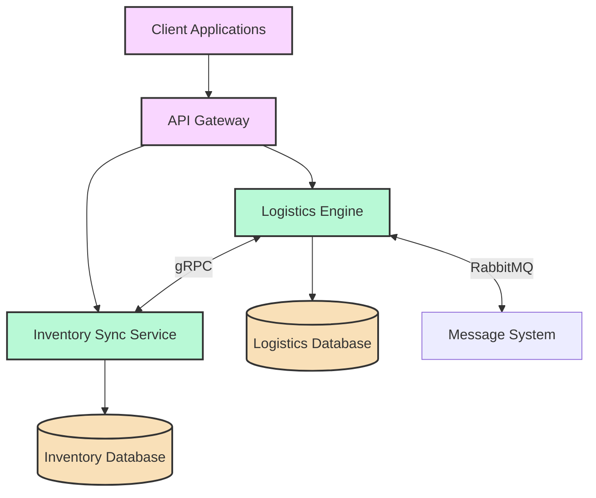
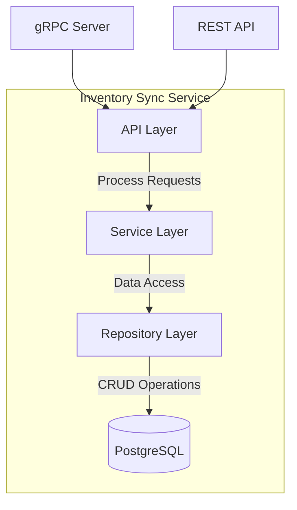
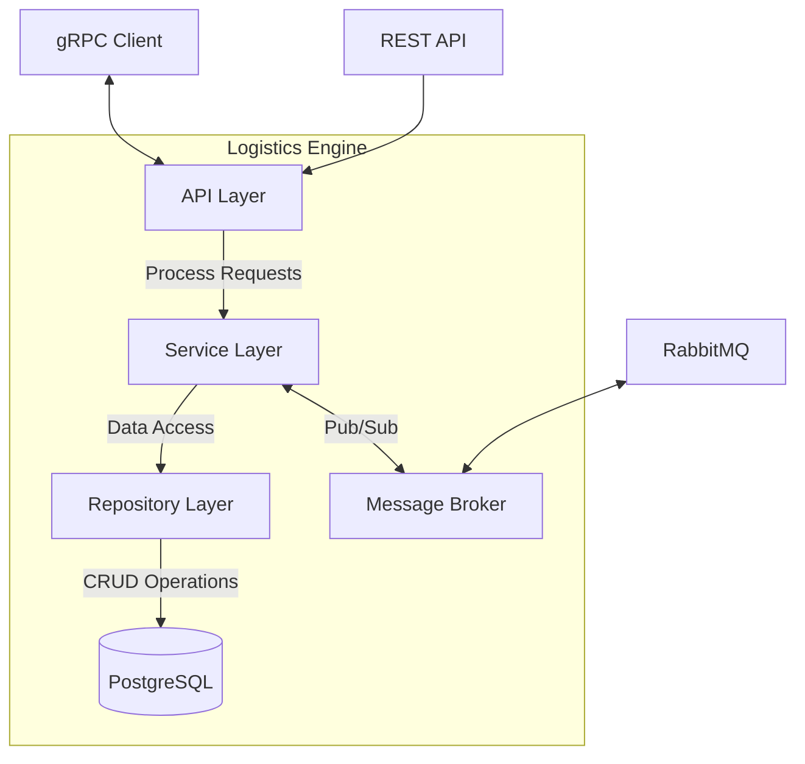
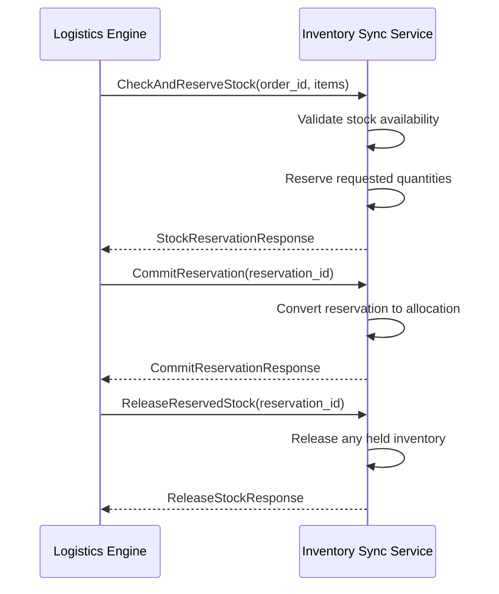
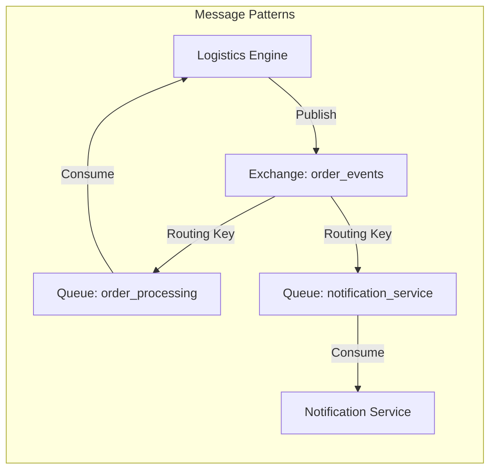
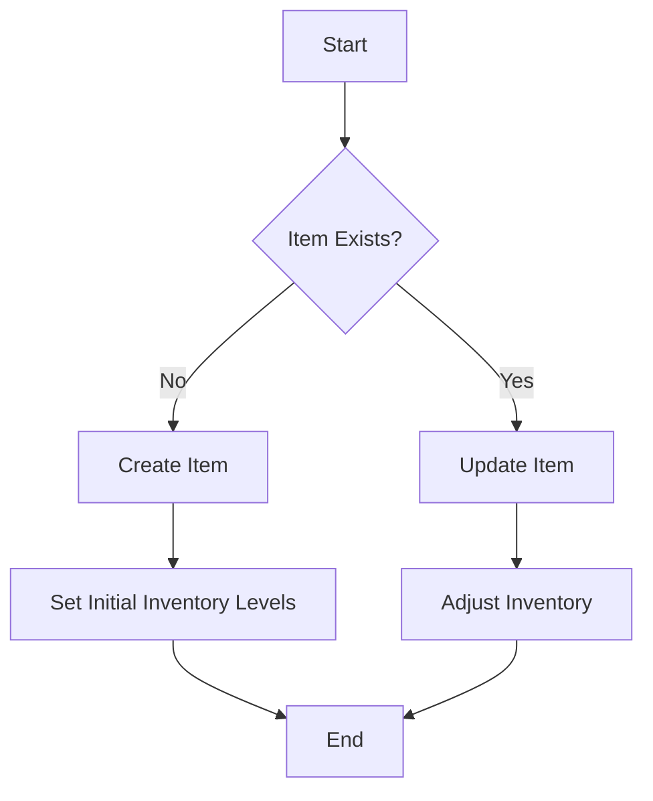
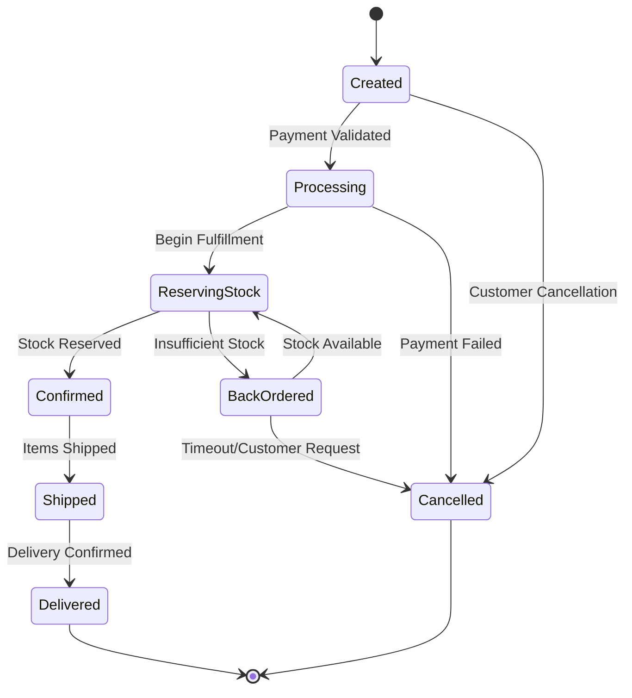
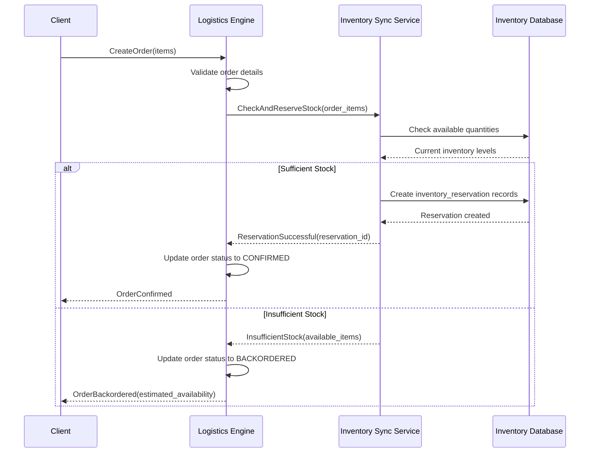
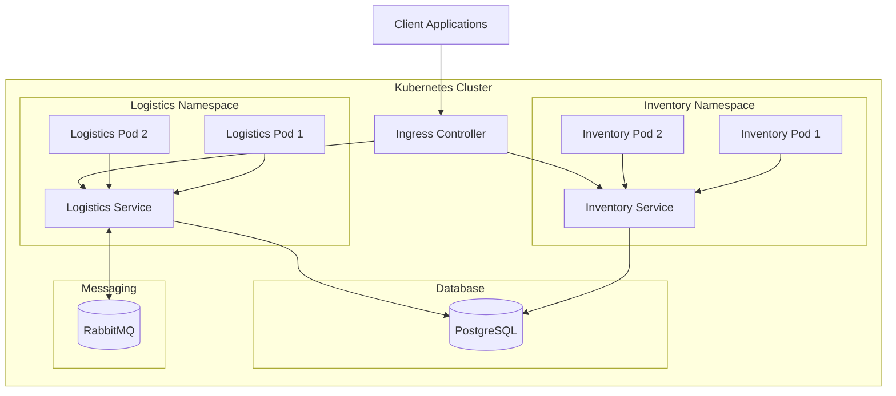
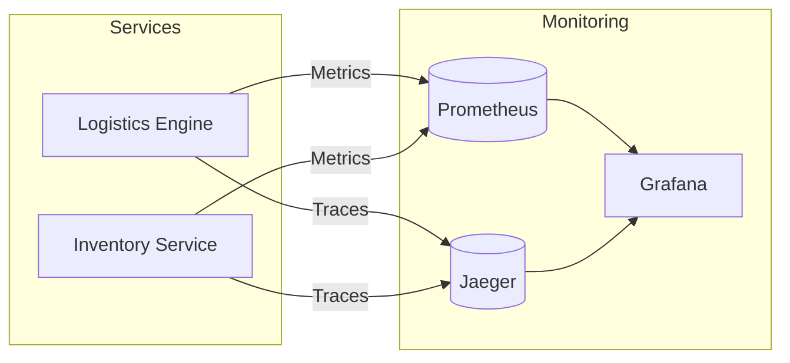

# Synkro Inventory and Logistics Architecture

## Table of Contents

1. [System Overview](#system-overview)
2. [Services Architecture](#services-architecture)
   - [Inventory Sync Service](#inventory-sync-service)
   - [Logistics Engine](#logistics-engine)
3. [Communication Patterns](#communication-patterns)
   - [gRPC Communication](#grpc-communication)
   - [RabbitMQ Message Patterns](#rabbitmq-message-patterns)
4. [Key Operations](#key-operations)
   - [Inventory Management](#inventory-management)
   - [Order Processing](#order-processing)
   - [Stock Reservation](#stock-reservation)
5. [Data Models](#data-models)
6. [API Reference](#api-reference)
7. [Deployment Architecture](#deployment-architecture)
8. [Monitoring and Observability](#monitoring-and-observability)

## System Overview

Synkro is a distributed microservices platform designed to handle inventory management and logistics operations for e-commerce and retail applications. The system follows a modern cloud-native architecture with clearly defined service boundaries, communication protocols, and data ownership.

The system architecture follows these key principles:

1. **Service Independence**: Each service has clear responsibilities and owns its data
2. **API-First Design**: Well-defined APIs using gRPC and REST
3. **Event-Driven**: Critical state changes are communicated via messaging
4. **Database-Per-Service**: Each service manages its own data store
5. **Cloud-Native**: Designed for containerization and orchestration

## Services Architecture

### Inventory Sync Service

The Inventory Sync Service is responsible for tracking inventory levels, managing product data, and providing accurate stock availability information.

**Key Responsibilities:**
- Product/Item data management
- Inventory level tracking across warehouses
- Stock reservation and allocation
- Real-time inventory updates
- Inventory reporting

**Technical Implementation:**
- Built with Go
- PostgreSQL database
- gRPC and REST APIs
- Containerized deployment

#### Service Components:

1. **gRPC Server**: Exposes inventory operations to other services
2. **REST API**: HTTP endpoints for client applications
3. **Service Layer**: Business logic for inventory operations
4. **Repository Layer**: Data access and persistence
5. **Database**: PostgreSQL for inventory and product data

### Logistics Engine

The Logistics Engine orchestrates the entire order lifecycle, from creation to fulfillment, while managing shipping, payments, and customer information.

**Key Responsibilities:**
- Order management
- Payment processing
- Shipping coordination
- Customer data management
- Inventory reservation (via Inventory Sync Service)

**Technical Implementation:**
- Built with Rust
- PostgreSQL database
- gRPC client for Inventory Service
- RabbitMQ for event handling
- Actor-based processing model

#### Service Components:

1. **gRPC Client**: Communicates with Inventory Sync Service
2. **REST API**: HTTP endpoints for client applications
3. **Service Layer**: Order and shipping business logic
4. **Repository Layer**: Data access and persistence
5. **Database**: PostgreSQL for orders, customers, and shipping
6. **Message Broker**: RabbitMQ integration for event processing

## Communication Patterns

### gRPC Communication

gRPC is used for synchronous service-to-service communication, particularly between the Logistics Engine and Inventory Sync Service.

**Key gRPC Interactions:**

1. **Stock Reservation**: The Logistics Engine requests inventory reservations for orders
2. **Inventory Queries**: Checking current stock levels and availability
3. **Inventory Updates**: Committing or releasing reservations
4. **Product Information**: Retrieving product details needed for orders

### RabbitMQ Message Patterns

The system uses RabbitMQ for asynchronous event-based communication, particularly for order status updates and inventory changes.

**Message Types:**

1. **OrderCreated**: When a new order is placed
2. **OrderStatusChanged**: When order status is updated
3. **InventoryReserved**: When stock is successfully reserved
4. **PaymentProcessed**: When payment is processed
5. **ShipmentCreated**: When a shipment is created

## Key Operations

### Inventory Management

### Order Processing

### Stock Reservation

## Data Models

### Inventory Sync Service Models

#### Item
- `id`: UUID - Primary Key
- `sku`: String - Unique product identifier
- `name`: String - Product name
- `description`: String - Product description
- `category`: String - Product category
- `attributes`: JSON - Product attributes
- `created_at`: Timestamp - Creation timestamp
- `updated_at`: Timestamp - Last update timestamp

#### Inventory Level
- `item_id`: UUID - Foreign Key to Item
- `warehouse_id`: UUID - Foreign Key to Warehouse
- `quantity`: Integer - Total quantity
- `reserved`: Integer - Reserved quantity
- `available`: Integer - Available quantity
- `last_updated`: Timestamp - Last update timestamp
- Primary Key: (item_id, warehouse_id)

#### Warehouse
- `id`: UUID - Primary Key
- `name`: String - Warehouse name
- `location`: String - Warehouse location
- `is_active`: Boolean - Warehouse status
- `customer_id`: UUID - Customer ID (optional)

### Logistics Engine Models

#### Order
- `id`: UUID - Primary Key
- `customer_id`: UUID - Foreign Key to Customer
- `status`: String - Order status
- `created_at`: Timestamp - Creation timestamp
- `updated_at`: Timestamp - Last update timestamp
- `total_amount`: Decimal - Order total
- `currency`: String - Currency code

#### Order Item
- `id`: UUID - Primary Key
- `order_id`: UUID - Foreign Key to Order
- `product_id`: UUID - Product ID
- `sku`: String - Product SKU
- `quantity`: Integer - Quantity ordered
- `unit_price`: Decimal - Price per unit
- `total_price`: Decimal - Total price

#### Inventory Reservation
- `id`: UUID - Primary Key
- `order_id`: UUID - Foreign Key to Order
- `item_id`: UUID - Foreign Key to Item
- `quantity`: Integer - Reserved quantity
- `status`: String - Reservation status
- `created_at`: Timestamp - Creation timestamp
- `expires_at`: Timestamp - Expiration timestamp

## API Reference

### Inventory Sync Service gRPC Methods

| Method | Description | Request | Response |
|--------|-------------|---------|----------|
| `CreateItem` | Creates a new item | CreateItemRequest | ItemResponse |
| `GetItem` | Retrieves item by ID | GetItemRequest | ItemResponse |
| `UpdateItem` | Updates an existing item | UpdateItemRequest | ItemResponse |
| `DeleteItem` | Deletes an item | DeleteItemRequest | DeleteItemResponse |
| `ListItems` | Lists items with pagination | ListItemsRequest | ListItemsResponse |
| `GetInventoryLevels` | Gets inventory levels | GetInventoryLevelsRequest | GetInventoryLevelsResponse |
| `AdjustInventory` | Adjusts inventory quantity | AdjustInventoryRequest | AdjustInventoryResponse |
| `AllocateInventory` | Allocates inventory for an order | AllocateInventoryRequest | AllocateInventoryResponse |
| `ReleaseInventory` | Releases allocated inventory | ReleaseInventoryRequest | ReleaseInventoryResponse |
| `CheckAndReserveStock` | Checks and reserves stock | StockReservationRequest | StockReservationResponse |
| `ReleaseReservedStock` | Releases reserved stock | ReleaseStockRequest | ReleaseStockResponse |
| `CommitReservation` | Commits a reservation | CommitReservationRequest | CommitReservationResponse |

### Logistics Engine gRPC Methods

| Method | Description | Request | Response |
|--------|-------------|---------|----------|
| `CreateOrder` | Creates a new order | CreateOrderRequest | OrderResponse |
| `GetOrder` | Retrieves order by ID | GetOrderRequest | OrderResponse |
| `UpdateOrderStatus` | Updates order status | UpdateOrderStatusRequest | OrderResponse |
| `ListOrders` | Lists orders with filtering | ListOrdersRequest | ListOrdersResponse |
| `StreamOrderUpdates` | Streams order status updates | StreamOrderUpdatesRequest | Stream<OrderStatusEvent> |

## Deployment Architecture

The system is designed for containerized deployment in Kubernetes.

## Monitoring and Observability

The system implements comprehensive monitoring and observability:

1. **Metrics**: Prometheus for metrics collection
2. **Logging**: Structured JSON logging for all services
3. **Tracing**: Jaeger for distributed tracing
4. **Alerting**: Prometheus Alertmanager
5. **Dashboards**: Grafana dashboards for visualization

This architecture provides a robust, scalable, and maintainable platform for handling complex inventory and logistics operations with high reliability and performance. 