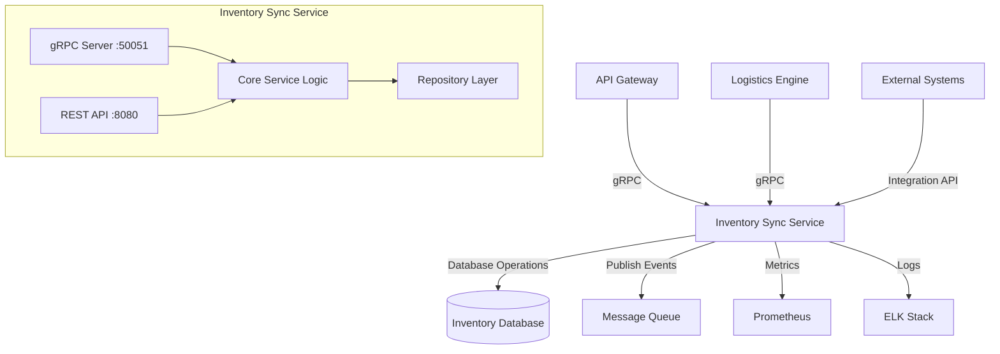

# Inventory Sync Service Implementation Plan

## Overview

The Inventory Sync Service is a critical microservice within the Synkro ecosystem, responsible for managing inventory-related operations and providing real-time inventory data synchronization across the platform. Built with Go using a gRPC and REST dual-interface architecture, it provides both high-performance RPC capabilities and a standard HTTP API.

## Service Responsibilities

- Maintain a centralized inventory database
- Provide real-time inventory updates and synchronization
- Handle inventory allocation and reservations
- Process inventory adjustments and corrections
- Integrate with external inventory systems
- Support both bulk and individual item operations
- Provide inventory analytics and reporting capabilities

## Architecture



## Technical Stack

- **Language**: Go 1.21+
- **Framework**: Standard library with Gin for HTTP
- **gRPC**: Google's gRPC framework with Protocol Buffers
- **Database**: PostgreSQL (with potential for caching layer)
- **Message Queue**: RabbitMQ for event publishing
- **Observability**: Prometheus metrics + ELK for logging
- **Testing**: Standard Go testing package + testify

## API Design

### gRPC Service Definition

The service exposes the following gRPC methods:

```protobuf
service InventoryService {
    // Item Management
    rpc CreateItem(CreateItemRequest) returns (ItemResponse);
    rpc GetItem(GetItemRequest) returns (ItemResponse);
    rpc UpdateItem(UpdateItemRequest) returns (ItemResponse);
    rpc DeleteItem(DeleteItemRequest) returns (DeleteItemResponse);
    rpc ListItems(ListItemsRequest) returns (ListItemsResponse);
    
    // Inventory Operations
    rpc AdjustInventory(AdjustInventoryRequest) returns (AdjustInventoryResponse);
    rpc AllocateInventory(AllocateInventoryRequest) returns (AllocateInventoryResponse);
    rpc ReleaseInventory(ReleaseInventoryRequest) returns (ReleaseInventoryResponse);
    
    // Bulk Operations
    rpc BulkCreateItems(BulkCreateItemsRequest) returns (BulkCreateItemsResponse);
    rpc BulkUpdateItems(BulkUpdateItemsRequest) returns (BulkUpdateItemsResponse);
    
    // Real-time Streams
    rpc StreamInventoryUpdates(StreamInventoryUpdatesRequest) returns (stream InventoryUpdateEvent);
    
    // Reporting
    rpc GetInventoryReport(GetInventoryReportRequest) returns (InventoryReportResponse);
}
```

### REST API Endpoints

The service also exposes a REST API for services that don't support gRPC:

```
GET    /health                          # Health check endpoint
GET    /api/v1/items                    # List all items
GET    /api/v1/items/:id                # Get a specific item
POST   /api/v1/items                    # Create a new item
PUT    /api/v1/items/:id                # Update an item
DELETE /api/v1/items/:id                # Delete an item
POST   /api/v1/items/bulk               # Bulk create items
PUT    /api/v1/items/bulk               # Bulk update items
POST   /api/v1/inventory/adjust         # Adjust inventory levels
POST   /api/v1/inventory/allocate       # Allocate inventory
POST   /api/v1/inventory/release        # Release allocated inventory
GET    /api/v1/reports/inventory        # Get inventory reports
```

## Data Models

### Core Models

```go
// Item represents an inventory item
type Item struct {
    ID          string    `json:"id"`
    SKU         string    `json:"sku"`
    Name        string    `json:"name"`
    Description string    `json:"description"`
    Category    string    `json:"category"`
    Attributes  JSONMap   `json:"attributes"`
    CreatedAt   time.Time `json:"created_at"`
    UpdatedAt   time.Time `json:"updated_at"`
}

// InventoryLevel represents the current inventory level for an item
type InventoryLevel struct {
    ItemID       string    `json:"item_id"`
    Quantity     int64     `json:"quantity"`
    Reserved     int64     `json:"reserved"`
    Available    int64     `json:"available"`
    LocationID   string    `json:"location_id"`
    LastUpdated  time.Time `json:"last_updated"`
}

// InventoryTransaction records inventory changes
type InventoryTransaction struct {
    ID           string    `json:"id"`
    ItemID       string    `json:"item_id"`
    Quantity     int64     `json:"quantity"`
    Type         string    `json:"type"` // "add", "remove", "allocate", "release"
    Reference    string    `json:"reference"`
    LocationID   string    `json:"location_id"`
    Timestamp    time.Time `json:"timestamp"`
    UserID       string    `json:"user_id"`
}

// Location represents a physical inventory location
type Location struct {
    ID          string    `json:"id"`
    Name        string    `json:"name"`
    Description string    `json:"description"`
    Address     Address   `json:"address"`
    Active      bool      `json:"active"`
    CreatedAt   time.Time `json:"created_at"`
    UpdatedAt   time.Time `json:"updated_at"`
}
```

## Integration Points

### Logistics Engine Integration

The Inventory Sync Service must integrate with the Logistics Engine to:
- Provide inventory availability for order fulfillment
- Reserve inventory when orders are created
- Release inventory when orders are canceled
- Update inventory levels when orders are shipped or received

### API Gateway Integration

The service communicates with the API Gateway for:
- Authentication and authorization validation
- User-initiated inventory operations
- Reporting data for dashboards
- System-wide inventory status updates

### External System Integration

Integration with external inventory systems through:
- Scheduled data synchronization jobs
- Webhooks for real-time updates
- Bulk import/export capabilities
- API endpoints for third-party integrations

## Development Roadmap

### Phase 1: Core Infrastructure (Week 1-2)

- Set up project structure
- Implement gRPC and HTTP server frameworks
- Define Protocol Buffer schemas
- Create database schema and migrations
- Implement basic CRUD operations
- Set up observability (metrics & logging)
- Create health check and basic monitoring endpoints

### Phase 2: Core Inventory Features (Week 3-4)

- Implement inventory level tracking
- Build transaction recording system
- Develop allocation and reservation system
- Create inventory adjustment workflows
- Implement basic validation rules
- Build initial reporting capabilities
- Integrate with authentication system

### Phase 3: Integration & Advanced Features (Week 5-6)

- Integrate with Logistics Engine
- Implement real-time update streams
- Build bulk operation capabilities
- Create advanced reporting and analytics
- Set up cache layer for performance
- Implement rate limiting and throttling
- Build failover and error recovery mechanisms

### Phase 4: Testing & Optimization (Week 7-8)

- Comprehensive testing (unit, integration, performance)
- Performance optimization
- Security auditing
- Documentation completion
- Deployment pipeline setup
- Production readiness review

## Testing Strategy

### Unit Testing

- Service logic: Test all business logic functions
- Repository layer: Mock database for testing data operations
- API handlers: Test request handling and response formation
- Protocol validation: Ensure proper message serialization

### Integration Testing

- Database integration: Test actual database operations
- API endpoint testing: Verify HTTP endpoints
- gRPC method testing: Test all gRPC service methods
- Inter-service communication: Test integration with other services

### Performance Testing

- Load testing: Verify throughput under various loads
- Stress testing: Identify breaking points
- Resource utilization: Monitor CPU, memory, and I/O under load
- Latency profiling: Ensure acceptable response times

## Deployment Considerations

### Kubernetes Deployment

- Define resource requirements
- Set up appropriate liveness and readiness probes
- Configure horizontal pod autoscaling
- Define network policies
- Set up proper secrets management

### Configuration Management

- Environment-specific configurations
- Secret management for sensitive data
- Feature flags for gradual rollout
- Centralized configuration with dynamic updates

### High Availability

- Multi-instance deployment
- Proper database redundancy
- Graceful shutdown and startup
- Request retries and circuit breaking

## Service Dependencies

- **Database**: PostgreSQL for persistent storage
- **Message Queue**: RabbitMQ for event publishing
- **API Gateway**: For authentication and routing
- **Logging**: ELK stack for centralized logging
- **Metrics**: Prometheus for metrics collection

## Security Considerations

- Implement proper authentication for all API calls
- Validate and sanitize all input data
- Apply rate limiting to prevent abuse
- Implement audit logging for sensitive operations
- Secure database connection with TLS
- Regularly update dependencies for security patches

## Conclusion

The Inventory Sync Service is a critical component of the Synkro ecosystem, providing real-time inventory management capabilities. This implementation plan outlines the approach to building a robust, scalable, and maintainable service that meets the business requirements while adhering to best practices in microservice architecture. 